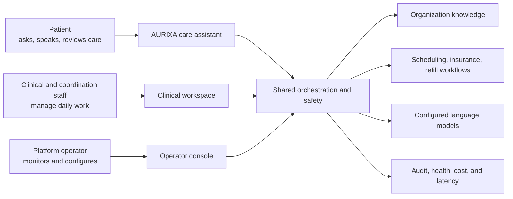
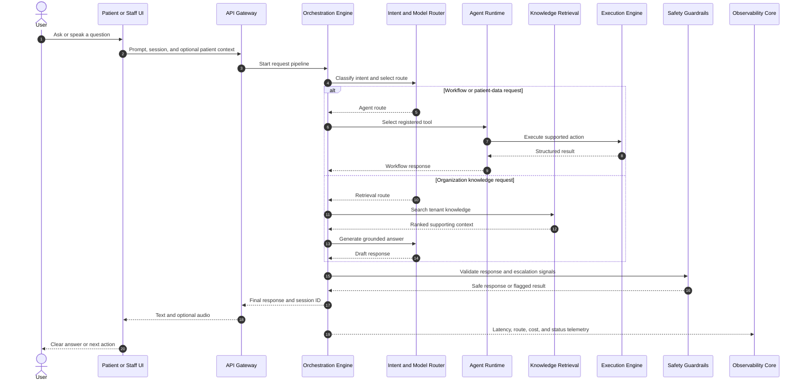
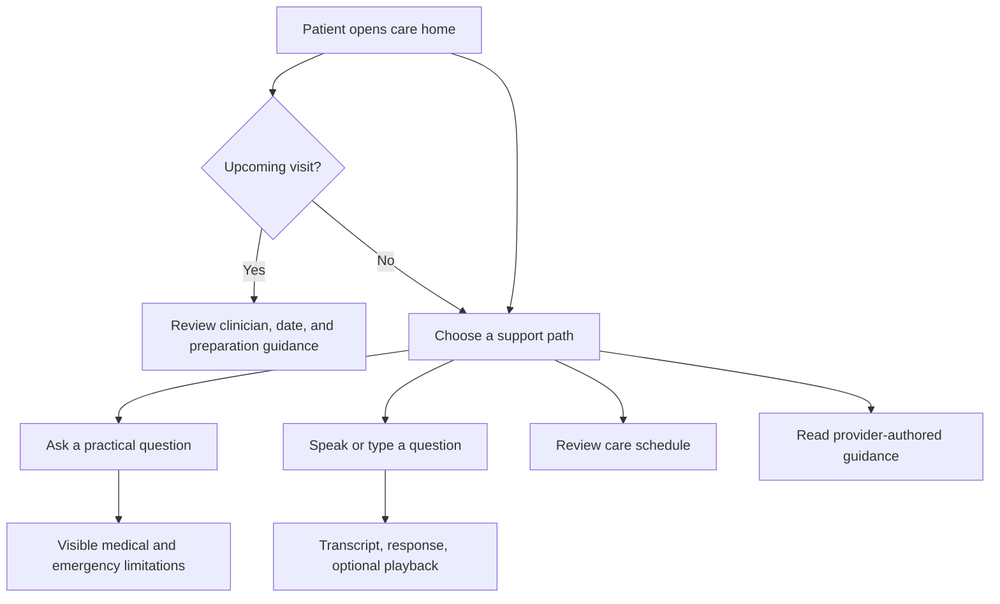
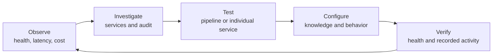
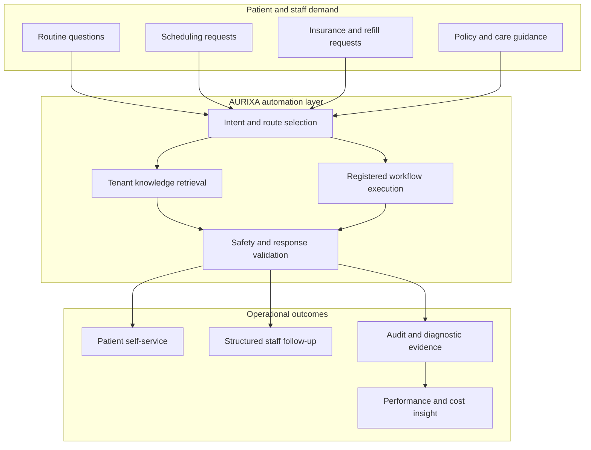
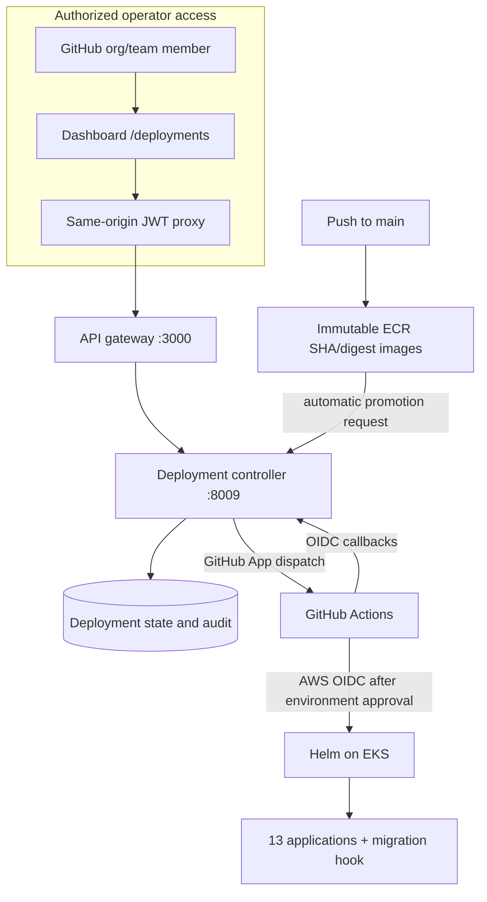

# AURIXA

[](https://www.typescriptlang.org/)
[](https://www.python.org/)
[](https://nodejs.org/)
[](https://fastapi.tiangolo.com/)
[](https://www.fastify.io/)
[](https://nextjs.org/)
[](https://www.postgresql.org/)
[](https://redis.io/)
[](https://www.docker.com/)
[](https://turbo.build/)

> **Conversational care operations platform** — A multi-tenant foundation for patient self-service,
> staff workflows, governed AI assistance, and observable healthcare automation.

<p align="center">
  <a href="#product--business-overview">Product Overview</a> •
  <a href="#how-the-aurixa-assistant-works">Assistant Use Cases</a> •
  <a href="#experiences-for-every-side-of-care">User Experiences</a> •
  <a href="#quick-start">Quick Start</a> •
  <a href="#architecture">Architecture</a> •
  <a href="#service-architecture--responsibilities">Services</a> •
  <a href="#development-workflow">Development</a> •
  <a href="#deployment">Deployment</a>
</p>

---

## Product & Business Overview

**AURIXA is a conversational care operations platform for healthcare organizations.** It gives
patients a calm self-service experience, gives staff a shared clinical operations workspace, and
gives platform teams the controls required to operate the underlying automation safely.

Instead of deploying a disconnected chatbot, scheduling tool, knowledge search, and service
dashboard, an organization can use AURIXA as one coordinated layer across the care journey:



> [!IMPORTANT]
> AURIXA is a decision-support and workflow platform, not a clinician. Patient-facing responses
> clearly state that the assistant does not diagnose conditions or provide emergency care.
> Organizations remain responsible for clinical review, privacy controls, integrations, and local
> regulatory requirements.

### The product in one view

| Product surface        | Primary users                                                | What it enables                                                                                          | Business value                                                                       |
| ---------------------- | ------------------------------------------------------------ | -------------------------------------------------------------------------------------------------------- | ------------------------------------------------------------------------------------ |
| **Patient Portal**     | Patients and caregivers                                      | Appointment visibility, practical care questions, voice interaction, provider-authored help              | Reduces avoidable calls and makes routine information available outside office hours |
| **Clinical Workspace** | Clinicians, nurses, schedulers, reception, support staff     | Patient lookup, appointment coordination, scheduling, contextual assistance, knowledge access            | Creates a shared operational view and reduces repeated manual lookup                 |
| **Operator Console**   | Platform admins, support engineers, analysts, content owners | Service health, audit activity, tenant management, knowledge curation, analytics, configuration, testing | Makes the automation observable, testable, and supportable                           |
| **Assistant Runtime**  | Embedded across all experiences                              | Routes requests through knowledge retrieval, tools, safety checks, and model providers                   | Reuses one governed automation layer across multiple teams and channels              |

### Who AURIXA is for

<details open>
<summary><strong>Healthcare organizations and care networks</strong></summary>

- Offer one digital front door for routine patient questions and care navigation.
- Keep organization-specific guidance separate by tenant.
- Give staff a coordinated view of patients, appointments, and support workflows.
- Operate local or cloud language models according to deployment and cost requirements.

</details>

<details>
<summary><strong>Hospitals, clinics, and scheduling teams</strong></summary>

- Look up patient records and recent appointment context.
- Coordinate bookings and update appointment states with confirmation steps.
- Check availability, insurance information, and refill-request workflows through registered tools.
- Search approved organizational knowledge without leaving the active workflow.

</details>

<details>
<summary><strong>Platform, support, and AI operations teams</strong></summary>

- Inspect the health and latency of the complete service mesh.
- Review recorded actions and errors through the audit experience.
- Measure traffic, model cost, service performance, and platform activity.
- Test the complete pipeline or an individual service before releasing a configuration change.
- Copy privacy-redacted diagnostic bundles for incident triage.

</details>

---

## How the AURIXA Assistant Works

The assistant is the conversational entry point to the platform. It is available as **patient
webchat**, **patient voice**, and a **staff-facing contextual assistant**. The same request pipeline
can answer a knowledge question, look up operational data, or initiate a supported workflow.

### Functional bot use cases

| User intent                                | What the assistant does                                                                               | Typical result                                                   |
| ------------------------------------------ | ----------------------------------------------------------------------------------------------------- | ---------------------------------------------------------------- |
| “When is my next appointment?”             | Detects appointment intent, selects the agent path, and calls `get_appointments` with patient context | Returns the relevant appointment information                     |
| “Do you have anything available tomorrow?” | Routes to `get_availability` through the execution layer                                              | Returns available slots from the configured data source          |
| “I need to schedule a visit”               | Collects or receives patient context and invokes `create_appointment`                                 | Creates an appointment record when required fields are available |
| “Can I request a refill?”                  | Uses `request_prescription_refill` for an active prescription workflow                                | Records the refill request for staff follow-up                   |
| “What will my insurance cover?”            | Invokes `check_insurance` with the selected patient context                                           | Returns the stored coverage and copay information                |
| “What is your billing policy?”             | Searches tenant-scoped knowledge with hybrid retrieval, then generates a grounded response            | Returns an answer based on organization-authored content         |
| “Explain my next step”                     | Combines intent routing, available context, retrieval, and response generation                        | Produces a plain-language care-navigation answer                 |
| Spoken patient question                    | Converts audio to text, runs the same assistant pipeline, and optionally produces speech              | Displays a transcript and response, with optional audio playback |
| Staff question about an active patient     | Keeps patient context visible while the staff member queries workflows or knowledge                   | Returns a contextual answer without leaving the patient workflow |

### Request lifecycle



### Why the assistant is more than a chat interface

1. **It distinguishes questions from actions.** A policy question can use retrieval while an
   appointment request can use a registered tool.
2. **It preserves tenant context.** Knowledge and operational data can be scoped to the selected
   organization.
3. **It supports patient context.** Patient-aware requests can reach appointment, insurance,
   availability, and refill workflows.
4. **It validates responses before delivery.** Safety checks can redact detected PII, reject banned
   content, and flag configured emergency language.
5. **It records operational evidence.** Sessions, audit activity, pipeline steps, model use, cost,
   and latency can be inspected by authorized operators.
6. **It supports multiple model strategies.** Organizations can configure local OpenAI-compatible
   models or supported cloud providers.
7. **It degrades explicitly.** The interfaces distinguish unavailable, stale, partial, and empty
   states instead of presenting missing data as a confident answer.

> [!NOTE]
> A valid local or cloud model provider must be configured for generated responses. Database-backed
> screens and health checks can still run without a cloud model, but conversational generation
> cannot produce a useful answer without an available provider.

---

## Experiences for Every Side of Care

### Patient experience

The Patient Portal is designed around one question: **“What do you need today?”**



#### What patients can do

- See the next confirmed appointment and preparation guidance immediately.
- Review upcoming and previous appointments in a plain-language timeline.
- Ask about appointments, billing, prescription refills, insurance, or care navigation.
- Speak a request or type it, then read the transcript and optionally hear the response.
- Browse provider-authored help content through an accessible support hub.
- Understand when the assistant is unavailable, when information is incomplete, and when a person
  or emergency service is the correct next step.
- Keep conversation previews minimized on the home page to reduce accidental disclosure.

#### Patient-facing design principles

- Warm, low-anxiety visual language with clear primary actions.
- Large touch targets and keyboard-visible focus states.
- No diagnosis claims and no hidden emergency limitations.
- Plain language instead of internal service or model terminology.
- Reduced-motion support and non-color status labels.

### Clinical and coordination experience

The Clinical Workspace helps staff move from **today’s work** to the relevant patient or action
without navigating through unrelated platform controls.

#### What staff can do

- Select the acting staff member and organization context for the current workspace.
- View a ranked daily appointment queue with freshness information.
- Search and filter the patient directory.
- Open a patient view with identity and appointment history kept visible.
- Add patients through a validated, accessible workflow.
- Review appointments by date and organization.
- Confirm completion or cancellation before updating an appointment.
- Schedule a patient with provider, date, time, and reason, then review the booking before submission.
- Ask the contextual assistant about scheduling, insurance, availability, or approved knowledge.
- Search tenant-scoped knowledge articles.
- Review platform status and copy a privacy-redacted support bundle.

#### Role-aware workspace behavior

| Staff context                           | Prioritized experience                                                   |
| --------------------------------------- | ------------------------------------------------------------------------ |
| **Clinician / nurse**                   | Today, patients, appointments, knowledge, contextual assistant           |
| **Scheduler / coordinator / reception** | Today, appointments, scheduling, patients                                |
| **Admin / operations / support**        | Today, organization context, status, diagnostics, and broader navigation |

The role selection changes information priority and navigation order in the interface. It is a
workspace preference for the current implementation—not a replacement for production identity and
authorization enforcement.

### Platform operator experience

The Operator Console is the control surface for running AURIXA as a product.

#### What operators can do

- See returned service checks, degraded services, and data freshness at a glance.
- Switch between operator, support, analyst, and administrator views.
- Navigate with grouped desktop navigation, a focused mobile dock, or `⌘/Ctrl + K`.
- Inspect service status, latency, telemetry, and privacy-redacted diagnostics.
- Filter and export audit activity.
- Review usage, performance, event volume, and estimated model cost.
- Create and maintain tenant organizations.
- Curate tenant-specific knowledge articles used by retrieval.
- Separate read-only runtime facts from editable behavior settings.
- Use `/deployments` to inspect environment health and drift, compose staged
  releases, follow approvals and rollout checks, cancel active jobs, and request
  audited rollback.
- Run a full request, a service test suite, individual service checks, or execution actions in the
  focused Playground.



---

## Business Value & Operating Model

### Problems the platform is designed to address

- **Repetitive administrative demand** — routine appointment, billing, insurance, and policy
  questions consume staff time.
- **Fragmented patient access** — patients often move between phone calls, static FAQs, portals, and
  scheduling teams to complete one task.
- **Disconnected automation** — a chatbot that cannot retrieve approved knowledge or execute a
  workflow creates another dead end.
- **Unobservable model usage** — healthcare organizations need to understand which services and
  models were used, what they cost, and where failures occurred.
- **Tenant complexity** — multi-organization platforms need separate content, configuration, and
  operational context.
- **Unsafe certainty** — missing or stale data must be communicated explicitly rather than turned
  into a confident-looking response.

### Expected value by stakeholder

| Stakeholder                 | Operational value                                                     | Suggested measures                                                                      |
| --------------------------- | --------------------------------------------------------------------- | --------------------------------------------------------------------------------------- |
| **Patients**                | Faster access to routine information and clearer next steps           | Self-service completion, response time, appointment visibility, support escalation rate |
| **Care teams**              | Less repeated lookup and better shared context                        | Time per routine request, manual handoffs, knowledge-search time                        |
| **Scheduling teams**        | One path for availability, bookings, and appointment states           | Booking completion, abandoned requests, correction rate                                 |
| **Support teams**           | Reproducible diagnostics and centralized service evidence             | Time to triage, incident recurrence, unresolved service checks                          |
| **Platform owners**         | Provider flexibility, cost visibility, and tenant-scoped operations   | Cost per conversation, cache use, model mix, p95 latency, error rate                    |
| **Organization leadership** | A reusable digital service layer across patient and staff experiences | Digital adoption, call deflection, staff capacity, service availability                 |

These are **measurement categories**, not guaranteed outcomes. Results depend on workflow design,
source-system quality, model configuration, adoption, staffing, and production integrations.

### Business workflow map



### Deployment and commercialization paths

<details open>
<summary><strong>1. Demonstration or workflow-discovery environment</strong></summary>

Use the seeded Docker stack to demonstrate patient, staff, and operator journeys. The Playground can
verify service behavior and show where organization-specific integrations would connect.

</details>

<details>
<summary><strong>2. Controlled internal pilot</strong></summary>

Connect approved knowledge, configure one model provider, define a limited set of workflows, and
measure self-service completion, escalations, latency, and staff feedback with a small user group.

</details>

<details>
<summary><strong>3. Organization-integrated deployment</strong></summary>

Replace seeded workflow data with adapters for the organization’s scheduling, EHR, billing,
insurance, identity, and communications systems. Apply tenant policies, production secrets,
retention rules, and audit requirements.

</details>

<details>
<summary><strong>4. Multi-tenant platform offering</strong></summary>

Use the organization, knowledge, configuration, analytics, and service-control surfaces as the
foundation for a managed product. Commercial packaging can be based on organizations, seats,
conversations, enabled channels, model consumption, or supported workflows.

> Billing, subscriptions, customer provisioning, and entitlement enforcement are product
> integration points; they are not implemented as a complete commercial billing system in this
> repository.

</details>

### Product readiness boundaries

The repository provides a complete demonstrable application stack and working database-backed
workflows. Production use still requires organization-specific hardening and integrations.

| Capability                                                 | Current position                                                                                   |
| ---------------------------------------------------------- | -------------------------------------------------------------------------------------------------- |
| Patient webchat, REST voice, staff assistant               | Implemented; generated answers require a configured model/STT/TTS provider as applicable           |
| Appointment, availability, insurance, and refill workflows | Database-backed demonstration workflows; replace with production source-system adapters            |
| Tenant knowledge and hybrid retrieval                      | Implemented with tenant-scoped articles, BM25/vector retrieval, and fallback documents             |
| Safety and PII controls                                    | Implemented baseline checks; not a substitute for clinical governance or a full compliance program |
| Observability and audit views                              | Implemented for service health, recorded activity, latency, event, and model-cost telemetry        |
| Role-aware navigation                                      | Implemented as UI context; production RBAC and identity enforcement require deployment integration |
| Telephony, SMS, WhatsApp, native mobile SDK                | Planned integration surfaces; not complete channels in the current repository                      |
| Commercial billing and subscriptions                       | Not implemented                                                                                    |
| Production EHR and payer connectivity                      | Adapter scaffolding/demonstration data; organization integration required                          |

---

## Architecture

AURIXA uses a microservices data plane and a separate, auditable deployment
control plane. The canonical inventory contains **13 deployable applications**:
ten backend services and three frontends. `db-migrations` is an additional
release artifact, not a long-running service.



The application services are stateless where practical; persistent application
and deployment state lives in PostgreSQL, with Redis used for caching. Requests
enter through the API gateway, while cloud mutations are owned by approved
GitHub Actions workflows.

<details open>
<summary><b>System Architecture Diagram</b></summary>

```
┌─────────────────────────────────────────────────────────────────────────────┐
│                            CLIENT APPLICATIONS                              │
│                                                                              │
│  ┌─────────────────────────────────┐  ┌─────────────────────────────────┐   │
│  │     Dashboard (Unified Admin)    │  │  Patient Portal                 │   │
│  │        (Next.js 15)              │  │     (Next.js 15)                 │   │
│  │        Port 3100                 │  │     Port 3300                   │   │
│  └─────────────────────────────────┘  └─────────────────────────────────┘   │
│                                  ▲                                           │
└──────────────────────────────────┼───────────────────────────────────────────┘
                                   │ HTTPS / WebSocket
┌──────────────────────────────────┼───────────────────────────────────────────┐
│                                  │                                           │
│                    ┌─────────────▼─────────────┐                            │
│                    │    API GATEWAY            │                            │
│                    │  Fastify 5 + Plugins      │                            │
│                    │  • Rate Limiting          │                            │
│                    │  • CORS & Security        │                            │
│                    │  • WebSocket Proxy        │                            │
│                    │  • Request Logging        │                            │
│                    │     Port 3000             │                            │
│                    └────────────┬──────────────┘                            │
│                                 │                                           │
│     ┌───────────────────────────┼───────────────────────────────┐          │
│     │                           │                               │          │
│ ┌───▼────────────┐   ┌──────────▼──────────┐   ┌───────────────▼────┐     │
│ │    REQUEST     │   │   ORCHESTRATION     │   │   OBSERVABILITY    │     │
│ │   ROUTING      │   │      ENGINE         │   │       CORE         │     │
│ │   & PROXYING   │   │   (FastAPI)         │   │    (FastAPI)       │     │
│ │                │   │   • State Mgmt      │   │   • Metrics        │     │
│ │                │   │   • Pipeline Exec   │   │   • Analytics      │     │
│ │                │   │   Port 8001         │   │   Port 8008        │     │
│ └────────────────┘   └──────────┬──────────┘   └────────────────────┘     │
│                                  │                                          │
│     ┌────────────────────────────┼────────────────────────────┐           │
│     │                            │                            │           │
│ ┌───▼──────┐  ┌──────────┐ ┌────▼─────┐ ┌──────────┐ ┌──────▼───┐       │
│ │ LLM      │  │  AGENT   │ │   RAG    │ │ SAFETY   │ │STREAMING │       │
│ │ ROUTER   │  │ RUNTIME  │ │ SERVICE  │ │GUARDRAILS│ │  VOICE   │       │
│ │(FastAPI) │  │(FastAPI) │ │(FastAPI) │ │(FastAPI) │ │(FastAPI) │       │
│ │• Routing │  │• Tools   │ │• Retrieval           │ │• Audio   │       │
│ │• Cost-Aware • Planning  │ │• Reranking           │ │• ASR     │       │
│ │Port 8002 │  │Port 8003 │ │Port 8004 │ │Port 8005 │ │Port 8006 │       │
│ └──────────┘  └──────────┘ └──────────┘ └──────────┘ └──────────┘       │
│                      │                                                     │
│                 ┌────▼─────────┐                                           │
│                 │   EXECUTION  │                                           │
│                 │   ENGINE     │                                           │
│                 │  (FastAPI)   │                                           │
│                 │  Port 8007   │                                           │
│                 └──────────────┘                                           │
└───────────────────────────────────────────────────────────────────────────┘
                         │
        ┌────────────────┴────────────────┐
        │                                 │
    ┌───▼───────┐               ┌────────▼────┐
    │PostgreSQL │               │    Redis    │
    │ Database  │               │    Cache    │
    │ Port 5432 │               │ Port 6379   │
    └───────────┘               └─────────────┘
```

</details>

---

## Features & Capabilities

### Pipeline Flow (E2E)

```
User → API Gateway (:3000)
  ↓
Orchestration Engine (:8001)
  ├─ 1. Intent → LLM Router (:8002) — semantic + keyword routing, model selection
  ├─ 2. Agent path (if appointment/insurance/search) → Agent Runtime (:8003)
  │      └─ Execution Engine (:8007) — get_appointments, check_insurance, etc. (DB-backed)
  ├─ 3. RAG path (else) → RAG Service (:8004) — hybrid BM25 + vector retrieval
  │      └─ LLM Router — generate response
  ├─ 4. Safety Guardrails (:8005) — validate, emergency escalation
  └─ 5. Response → User
```

- **Response caching**: Repeated prompts cached (TTL 300s) for cost reduction
- **Emergency escalation**: Safety detects clinical keywords (chest pain, stroke) and flags `requires_escalation`
- **Telemetry**: Orchestration, LLM Router, RAG emit to Observability Core

### Execution Engine (DB-Backed)

| Action                        | Description                                |
| ----------------------------- | ------------------------------------------ |
| `get_appointments`            | List upcoming appointments for a patient   |
| `create_appointment`          | Create appointment (patient, date, reason) |
| `check_insurance`             | Verify insurance coverage and copay        |
| `get_availability`            | List available slots by date               |
| `request_prescription_refill` | Submit refill for active prescriptions     |

### Database Schema

- **Patients**, **Appointments** (with reason), **Tenants**, **Conversations**
- **PatientInsurance** — plan, payer, copay, status
- **Prescription** — medication, status, refill_requested_at
- **AvailabilitySlot** — date, time, provider for scheduling
- **KnowledgeBaseArticle** — RAG documents per tenant

### Admin API (DB Writes)

| Endpoint                 | Method | Description    |
| ------------------------ | ------ | -------------- |
| `/api/v1/admin/tenants`  | POST   | Create tenant  |
| `/api/v1/admin/patients` | POST   | Create patient |

The Tenants page uses Add Tenant to create new organizations. Execution Engine handles appointment creation and prescription refill requests.

### Playground (Dashboard)

The **Playground** at http://localhost:3100/playground provides:

- **Service Health & Metrics** — Live backend health and latency; telemetry (conversations, tenants, patients, event counts, avg latency); auto-loads on open
- **Run All Tests** — One-click verification of all services; shows pass/fail and latency per test
- **Full pipeline test** — Run E2E with patient context and sample prompts
- **Service API tests** — Route, RAG, Safety, Agent, Execution, Knowledge Articles, LLM Providers, LLM Models, Audit Log, Service Health
- **Test results table** — Last 20 test runs with status, latency (ms), and errors
- **Execution actions** — get_appointments, check_insurance, get_availability, create_appointment (DB write), request_prescription_refill (DB write)
- **Flow visualization** — Intent → RAG/Agent → Generate → Safety steps

---

## Monorepo Structure

AURIXA uses **Turborepo** with **pnpm workspaces** for efficient dependency management and parallel task execution across all packages and services.

<details open>
<summary><b>Complete Directory Layout</b></summary>

```
aurixa/
├── apps/                          Independently deployable microservices
│   ├── api-gateway/               TypeScript/Fastify (Port 3000)
│   │   ├── src/
│   │   │   ├── index.ts           App initialization & service registry
│   │   │   ├── config.ts          Service endpoints configuration
│   │   │   ├── middleware/        Request logging, error handling
│   │   │   ├── routes/
│   │   │   │   ├── health.ts      Health check endpoints
│   │   │   │   ├── proxy.ts       Service routing & proxying
│   │   │   │   ├── websocket.ts   WebSocket connections
│   │   │   │   └── admin.ts       Admin endpoints
│   │   │   └── plugins/           Fastify plugin integrations
│   │   └── package.json
│   │
│   ├── orchestration-engine/      Python/FastAPI (Port 8001)
│   │   ├── src/orchestration_engine/
│   │   │   ├── main.py            Server initialization & lifecycle
│   │   │   ├── models.py          Pydantic request/response schemas
│   │   │   ├── config.py          Environment configuration
│   │   │   └── clients.py         Client service calls
│   │   └── pyproject.toml
│   │
│   ├── llm-router/                Python/FastAPI (Port 8002)
│   │   ├── src/llm_router/
│   │   │   ├── main.py            Routing logic & provider selection
│   │   │   ├── models.py          Pydantic schemas
│   │   │   └── config.py          Configuration & routing rules
│   │   └── pyproject.toml
│   │
│   ├── agent-runtime/             Python/FastAPI (Port 8003)
│   ├── rag-service/               Python/FastAPI (Port 8004)
│   ├── safety-guardrails/         Python/FastAPI (Port 8005)
│   ├── streaming-voice/           Python/FastAPI (Port 8006)
│   ├── execution-engine/          Python/FastAPI (Port 8007)
│   ├── observability-core/        Python/FastAPI (Port 8008)
│   └── deployment-controller/     Python/FastAPI (Port 8009)
│
├── packages/                      Shared libraries & utilities
│   ├── llm-clients/               AI provider abstraction layer
│   │   ├── src/aurixa_llm/
│   │   │   ├── base.py            Abstract LLM client interface
│   │   │   ├── types.py           Shared type definitions
│   │   │   ├── router.py          Multi-provider router
│   │   │   ├── openai_client.py   OpenAI integration
│   │   │   ├── anthropic_client.py Anthropic integration
│   │   │   └── gemini_client.py   Google Gemini integration
│   │   └── pyproject.toml
│   │
│   ├── db/                        Database layer
│   │   ├── src/aurixa_db/
│   │   │   ├── models.py          SQLAlchemy ORM models
│   │   │   └── database.py        Database engine & session
│   │   ├── seed.py                Database seeding script
│   │   └── pyproject.toml
│   │
│   ├── auth/                      Authentication & authorization
│   │   ├── src/
│   │   │   ├── index.ts           JWT & API key validation
│   │   │   └── python_auth.py     Python auth utilities
│   │   └── package.json
│   │
│   ├── config/                    Configuration management
│   │   ├── src/
│   │   │   └── index.ts           Env loading, validation, secrets
│   │   └── package.json
│   │
│   ├── logging/                   Structured logging
│   │   ├── src/
│   │   │   └── index.ts           Pino logger setup (TS)
│   │   ├── python_logger.py       Loguru logger setup (Python)
│   │   └── package.json
│   │
│   ├── telemetry/                 Observability & tracing
│   │   ├── src/
│   │   │   └── index.ts           OpenTelemetry setup
│   │   └── package.json
│   │
│   └── ui-kit/                    React components & styles
│       ├── src/
│       │   └── components/        Reusable React components
│       ├── tailwind.preset.js     Shared Tailwind config
│       └── package.json
│
├── frontend/                      User-facing applications
│   ├── dashboard/                 Unified admin: analytics, playground, tenants, services, audit, configuration (Next.js 15, Port 3100)
│   ├── patient-portal/            Patient interface (Next.js 15, Port 3300)
│   └── hospital-portal/           Hospital staff interface (Next.js 15, Port 3400)
│
├── infra/                         Infrastructure as Code
│   ├── deployment/                Canonical service inventory and schema
│   ├── docker/                    Local Compose and migration images
│   ├── helm/aurixa/               Production deployment chart and overlays
│   ├── k8s/                       Legacy/reference manifests; not the release path
│   └── terraform/                 AWS bootstrap and reusable modules
│
├── .env.example                   Example environment configuration
├── package.json                   Root workspace configuration
├── pnpm-workspace.yaml            Workspace definitions
├── pnpm-lock.yaml                 Locked dependency versions
├── tsconfig.base.json             Root TypeScript configuration
├── turbo.json                     Turborepo configuration
└── README.md                      This file
```

</details>

---

## Service Architecture & Responsibilities

| Service                   |  Port  |  Language  | Key Features                                                                                                                                                   |
| ------------------------- | :----: | :--------: | -------------------------------------------------------------------------------------------------------------------------------------------------------------- |
| **API Gateway**           | `3000` | TypeScript | Request routing, WebSocket proxy, Rate limiting, CORS, Security headers                                                                                        |
| **Orchestration Engine**  | `8001` |   Python   | Conversation state management, Pipeline orchestration, Database persistence                                                                                    |
| **LLM Router**            | `8002` |   Python   | Cost-aware provider routing, FAISS embeddings, Intelligent model selection                                                                                     |
| **Agent Runtime**         | `8003` |   Python   | Tool invocation, Multi-step planning, Function calling, Async execution                                                                                        |
| **RAG Service**           | `8004` |   Python   | Hybrid retrieval (BM25 + vectors), Reranking, Context compression, Source tracking                                                                             |
| **Safety Guardrails**     | `8005` |   Python   | Risk classification, Policy enforcement, Response filtering, Escalation logic                                                                                  |
| **Streaming Voice**       | `8006` |   Python   | Voice I/O: STT, TTS (OSS first). REST: full response; WebSocket: status + **LLM token stream** + TTS. Orchestration pipeline (and `/pipelines/stream` for WS). |
| **Execution Engine**      | `8007` |   Python   | External API calls, Retry logic, Idempotency, Task scheduling                                                                                                  |
| **Observability Core**    | `8008` |   Python   | Telemetry aggregation, Performance reports (`/api/v1/reports/performance`), Metrics, Cost analysis                                                             |
| **Deployment Controller** | `8009` |   Python   | Audited release state, approvals, GitHub App dispatch, OIDC callbacks, cancellation, and rollback                                                              |

---

## LLM Provider Abstraction Layer

The AURIXA platform provides a **pluggable, provider-agnostic LLM abstraction** through the `llm-clients` package. This enables seamless switching between providers without code changes and intelligent cost-aware routing.

<details open>
<summary><b>Provider Integration</b></summary>

### Supported Providers

| Provider          | Models                           | Status | Features                              |
| ----------------- | -------------------------------- | :----: | ------------------------------------- |
| **OpenAI**        | GPT-4o, GPT-4 Turbo, o1, o3-mini | Active | Tool calling, Vision, Streaming       |
| **Anthropic**     | Claude 3 Opus, Sonnet, Haiku     | Active | Extended context (200K), Native tools |
| **Google Gemini** | 2.0 Flash, 1.5 Pro, 1.5 Flash    | Active | Multimodal, Real-time streaming       |
| **Local**         | Any OpenAI-compatible            | Active | LM Studio, Ollama, vLLM               |

### Standard LLM Client Interface

```python
from aurixa_llm import LLMClient, LLMRequest, LLMResponse, LLMProvider

# Every provider implements this interface
class LLMClient(ABC):
    async def generate(request: LLMRequest) -> LLMResponse:
        """Generate text with optional tool calling."""
        ...

    async def health_check() -> bool:
        """Check provider availability."""
        ...

    def estimate_cost(prompt_tokens: int, completion_tokens: int) -> float:
        """Calculate estimated cost for a request."""
        ...
```

### Dynamic Provider Discovery

The LLM Router auto-detects configured providers from environment variables and builds an intelligent fallback chain:

```bash
# .env configuration
OPENAI_API_KEY=sk-...
ANTHROPIC_API_KEY=sk-ant-...
GOOGLE_AI_API_KEY=AIzaSy...
LM_STUDIO_BASE_URL=http://127.0.0.1:1234/v1  # LM Studio (local, cost-free)
```

**Automatic Provider Selection:**

- Detects available providers at startup
- Health checks run continuously
- Cost-aware routing prefers cheaper models for simple queries
- Automatic fallback if primary provider fails
- Hot-swappable at runtime (no restart needed)

</details>

---

## Quick Start

### Prerequisites

**Node.js** 20+ | **pnpm** 9+ | **Python** 3.11+ | **Docker & Docker Compose**

### Installation

```bash
# Clone repository
git clone <repo-url> aurixa && cd aurixa

# Install dependencies (for local dev)
pnpm install

# Setup environment variables
cp .env.example .env
```

### Run the Full Stack via Docker (Recommended)

Run the entire SaaS (Postgres, Redis, all backend services, and frontends) with Docker:

```bash
# From repo root: first time or after code changes (builds all images)
./scripts/docker-up.sh --build

# Subsequent runs (no rebuild)
./scripts/docker-up.sh
```

Or with Docker Compose directly:

```bash
cd infra/docker
docker compose down          # Stop and remove containers (optional)
docker compose up --build -d # Build and start all services in background
```

The stack will:

1. Start Postgres and Redis
2. Run db-seed to populate the database
3. Build and start API Gateway, Orchestration, LLM Router, Agent Runtime, RAG, Safety, Streaming Voice, Execution Engine, Observability Core, and Deployment Controller
4. Build and start Dashboard, Patient Portal, Hospital Portal

**Endpoints after startup:**

| Service               | URL                              |
| --------------------- | -------------------------------- |
| API Gateway           | http://localhost:3000            |
| Dashboard             | http://localhost:3100            |
| **Playground**        | http://localhost:3100/playground |
| Patient Portal        | http://localhost:3300            |
| Hospital Portal       | http://localhost:3400            |
| Orchestration         | http://localhost:8001            |
| LLM Router            | http://localhost:8002            |
| Agent Runtime         | http://localhost:8003            |
| RAG Service           | http://localhost:8004            |
| Safety Guardrails     | http://localhost:8005            |
| Streaming Voice       | http://localhost:8006            |
| Execution Engine      | http://localhost:8007            |
| Observability Core    | http://localhost:8008            |
| Deployment Controller | http://localhost:8009            |

**Stop the stack:**

```bash
cd infra/docker && docker compose down
```

### Run the Full Stack Locally (Alternative)

Start all services without Docker (Postgres/Redis still via Docker if available):

```bash
./scripts/kill-stack.sh
./scripts/run-stack.sh
```

The script will start Postgres/Redis (Docker), seed the DB, then run API Gateway, all Python services, and the three frontends. If Python services fail, run `./scripts/bootstrap-python.sh` once.

### Verify Installation

```bash
./scripts/e2e-check.sh
```

Or use the **Playground** at http://localhost:3100/playground — click **Run All Tests** to verify services.

Manually:

```bash
curl http://localhost:3000/health
curl http://localhost:8008/health   # Observability Core (telemetry)
curl http://localhost:3100/
curl http://localhost:3300/
curl http://localhost:3400/
```

### Alternative: Individual Services

```bash
# API Gateway
cd apps/api-gateway && pnpm dev

# Orchestration Engine
cd apps/orchestration-engine && uvicorn orchestration_engine.main:app --reload --port 8001
```

### Database Seeding

```bash
# Run manually if needed (run-stack does this automatically)
pnpm db:seed
```

### Frontend Applications

| App             | Port | Purpose                                                                                                                                   |
| --------------- | ---- | ----------------------------------------------------------------------------------------------------------------------------------------- |
| Dashboard       | 3100 | System status, **Playground** (E2E + service tests + metrics), tenants (with Add Tenant), services, analytics, knowledge, config, audit   |
| Patient Portal  | 3300 | Patient chat & appointments, help articles, AI assistant                                                                                  |
| Hospital Portal | 3400 | Staff dashboard (reception, nurses, doctors, schedulers), patients, appointments, scheduling, AI assistant, knowledge base, system status |

- **Playground** (`/playground`): Run All Tests, service health & telemetry, full pipeline, individual services (Route/RAG/Safety/Agent/Execution/Knowledge/LLM/Audit), and DB-backed execution actions including writes (create_appointment, request_prescription_refill)
- **Tenants** (`/tenants`): List tenants; Add Tenant creates new tenants (DB write)
- **Patient Portal — Voice** (`/voice`): Mic or text input; REST-based voice processing (STT → pipeline → optional TTS); user toggle for "Play aloud" (TTS on/off)
- All frontends use the API Gateway (port 3000). Deployment administration is
  available at `/deployments` in the dashboard and is backed by the
  Deployment Controller (port 8009).

---

## Development Workflow

### Project Commands

```bash
# Install all dependencies across workspace
pnpm install

# Development mode for all services
pnpm dev

# Build all TypeScript services
pnpm build

# Run linting across workspace
pnpm lint

# Type checking
pnpm typecheck

# Run tests
pnpm test

# Clean all build artifacts
pnpm clean
```

### Service-Specific Development

**API Gateway (TypeScript):**

```bash
cd apps/api-gateway
pnpm dev            # Hot-reload with tsx
pnpm build          # Compile to JavaScript
pnpm test           # Run tests with Vitest
```

**Orchestration Engine (Python):**

```bash
cd apps/orchestration-engine
uvicorn orchestration_engine.main:app --reload --port 8001
pytest tests/       # Run pytest
```

**LLM Router (Python):**

```bash
cd apps/llm-router
uvicorn llm_router.main:app --reload --port 8002
```

### Database Management

```bash
# Run database migrations (from packages/db)
cd packages/db
python seed.py      # Seed initial data

# Connect to PostgreSQL
psql -h localhost -U aurixa -d aurixa
```

---

## Observability & Monitoring

### Structured Logging

Every service emits **JSON-formatted logs** with automatic correlation:

```json
{
  "timestamp": "2026-02-14T10:30:45.123Z",
  "level": "info",
  "service": "llm-router",
  "correlationId": "req_abc123xyz",
  "requestId": "550e8400-e29b-41d4-a716-446655440000",
  "message": "LLM call completed",
  "duration_ms": 245,
  "tokens_used": { "prompt": 150, "completion": 45 },
  "cost_usd": 0.0075,
  "model": "gpt-4o",
  "provider": "openai"
}
```

**Log Levels:** `debug` | `info` | `warning` | `error` | `critical`

**Access logs with correlation:**

```bash
# Filter logs by request ID
docker-compose logs | grep "550e8400-e29b-41d4-a716-446655440000"

# Follow service logs
docker-compose logs -f orchestration-engine
```

### Performance Metrics & Telemetry

The **Observability Core** service (port 8008) collects and aggregates telemetry:

- **Health:** `GET http://localhost:8008/health` — returns service status and event count
- **Performance report:** `GET http://localhost:8008/api/v1/reports/performance` — overall and per-service metrics (latency, cost, counts)
- **Submit events:** `POST http://localhost:8008/api/v1/telemetry` — services send events for aggregation
- **Latency percentiles:** p50, p95, p99 (per service)
- **LLM costs:** Breakdown by provider and model
- **Error rates:** Percentage of failed requests

Ensure the observability-core container is running (`docker compose ps`); if it exits, check logs and rebuild (it requires `numpy` in its dependencies).

### Health Check Endpoints

All services expose `/health` endpoints:

```bash
curl http://localhost:8001/health

# Response:
{
  "service": "orchestration-engine",
  "status": "healthy",
  "database": "connected",
  "redis": "connected",
  "uptime_seconds": 3600,
  "memory_mb": 124.5
}
```

---

## CI/CD Pipeline

GitHub Actions owns cloud image publication, promotion, deployment, callbacks,
and rollback. The local deploy utility cannot mutate cloud environments.

### Workflows Overview

| Workflow                  | Trigger                      | Purpose                                                             |
| ------------------------- | ---------------------------- | ------------------------------------------------------------------- |
| **Image Build & Publish** | Push to `main` or manual     | Builds/scans 13 apps plus migrations, publishes ECR digest manifest |
| **Deploy**                | Controller workflow dispatch | Atomic Helm deploy, migration, rollout, tests, smoke, callbacks     |
| **Production Rollback**   | Approved manual dispatch     | Restores and verifies a selected Helm revision                      |
| **Docker Build**          | Push/PR                      | Build validation without cloud deployment                           |
| **Tests**                 | Push/PR                      | TypeScript and Python tests                                         |
| **Lint & Security**       | Push/PR                      | Formatting, lint, type, and security checks                         |

### Image and deployment workflow

Each successful `main` build publishes an immutable
`sha-<40-character-git-sha>` image to Amazon ECR for every application and the
`db-migrations` hook. The workflow records exact digests in an artifact,
publishes SBOM/provenance attestations, scans HIGH/CRITICAL findings, and then
requests automatic staging promotion through an OIDC-authenticated controller
callback. Optional GHCR mirroring is digest-preserving. **Docker Hub is not
part of the implemented release path.**

The controller uses a GitHub App installation token to dispatch `deploy.yml`.
Actions assumes AWS roles with OIDC, while callbacks to the controller use a
separate audience-restricted Actions OIDC token. Production is never
automatically promoted: configure required reviewers on the `production`
GitHub Environment.

### Test Workflow

Runs automated tests across all services:

**TypeScript Services:**

- ESLint
- Type checking (TypeScript compiler)
- Unit tests (Vitest)

**Python Services:**

- Type checking (Pyright)
- Unit tests (pytest)

### Lint & Security Workflow

Performs code quality and security checks:

- **ESLint** - JavaScript/TypeScript linting
- **Prettier** - Code formatting checks
- **Trivy** - Container and filesystem vulnerability scanning
- **Safety** - Python dependency vulnerability checking
- **pnpm audit** - Node.js dependency checking
- **Markdown Lint** - Documentation quality

### Local Testing

Test workflows locally before pushing:

```bash
# Run all tests
pnpm test

# Run linting
pnpm lint

# Format code
pnpm prettier --write .

# Type check
pnpm typecheck
```

### Deployment configuration

AWS/GitHub variables, controller/OAuth secrets, first-time provisioning, cost
drivers, and incident procedures are documented in
[Deployment infrastructure](./infra/DEPLOYMENT.md) and the
[Deployment runbook](./docs/DEPLOYMENT_RUNBOOK.md).

> [!IMPORTANT]
> No workflow automatically runs Terraform, and no AWS resources are created
> until an operator configures credentials and inputs, reviews a plan, and
> explicitly runs `terraform apply`.

---

## Deployment

### Local Development (Docker Compose)

Use the repository deploy utility for the local full stack:

```bash
pnpm run deploy validate
pnpm run deploy build
pnpm run deploy up
pnpm run deploy verify
pnpm run deploy status
pnpm run deploy down
```

The utility validates the canonical 13-application inventory and Compose
configuration. A service name can follow `build`, `up`, or `verify`. Cloud
deploy, promote, and rollback commands are intentionally refused locally.

### Docker Images

Each service has a `Dockerfile` in its app directory. Images are built with **monorepo root** as build context so shared packages (`packages/db`, `packages/llm-clients`, etc.) are available.

**Build all images:**

```bash
cd infra/docker
docker compose build
```

**Build a single service:**

```bash
docker build -f apps/api-gateway/Dockerfile -t aurixa/api-gateway:latest .
# Run from repo root so context includes package.json, packages/, apps/
```

### Kubernetes Deployment

The old files under `infra/k8s/` are legacy/reference manifests and are not a
complete deployment template. The implemented release path is the umbrella Helm
chart at `infra/helm/aurixa`, executed by the approved Deploy workflow. It
provides probes, autoscaling, network policy, disruption budgets, security
contexts, external secrets, ingress, migration hooks, and an in-cluster Helm
test.

### Cloud Deployment (AWS/Terraform)

Terraform provides state bootstrap and modules for networking, private EKS
nodes, immutable ECR repositories, encrypted RDS/ElastiCache, EKS add-ons, and
OIDC/IRSA. It does not apply itself.

```bash
cd infra/terraform/bootstrap
terraform init
terraform plan -var='state_bucket_name=<globally-unique-name>'
# Explicitly apply only after review.

cd ..
terraform init -backend-config=/secure/path/backend.hcl
terraform plan -var-file=environments/staging.tfvars
# Explicitly apply only after replacing example CIDRs and reviewing the plan.
```

See [Deployment infrastructure](./infra/DEPLOYMENT.md) for architecture and
required variables/secrets, and [Deployment runbook](./docs/DEPLOYMENT_RUNBOOK.md)
for provisioning, production approval, rollback, incidents, disaster recovery,
and cost controls.

---

## Architecture Principles

### 1. **Stateless Services**

All microservices are **stateless** and horizontally scalable. Persistent state is stored in PostgreSQL or Redis.

```python
# Good: State in database
conversation = await db.get_conversation(id)
conversation.status = "completed"
await db.save(conversation)

# Bad: State in memory
conversation_cache = {}  # Lost on restart!
```

### 2. **Asynchronous Processing**

Every service uses async/await patterns to handle concurrent requests without blocking:

```typescript
// API Gateway uses async Fastify
app.get('/api/v1/*', async (request, reply) => {
  const response = await httpClient.get(url);
  return response;
});

# Python services use async FastAPI
@app.post('/api/v1/generate')
async def generate(request: GenerateRequest):
    result = await llm_router.generate(request)
    return result
```

### 3. **Cost-Aware Routing**

The LLM Router intelligently selects providers based on:

- **Cost** - Prefers cheaper models when possible
- **Latency** - Considers response time SLAs
- **Availability** - Falls back to alternative providers
- **Complexity** - Routes complex tasks to capable models

### 4. **Graceful Degradation**

Services fail gracefully with sensible fallbacks:

```python
# RAG Service fallback
try:
    results = await vector_search(query)
except TimeoutError:
    results = await bm25_fallback(query)

# LLM Router fallback
try:
    response = await openai_client.generate(request)
except Exception:
    response = await anthropic_client.generate(request)  # Next in chain
```

### 5. **Observability-Driven Operations**

Every service reports metrics that drive scaling and optimization:

```python
# Telemetry example
@app.post('/api/v1/pipeline/execute')
async def execute_pipeline(request: PipelineRequest):
    start = time.time()

    result = await orchestration.execute(request)

    # Report metrics
    duration_ms = (time.time() - start) * 1000
    observability.record_metric(
        name='pipeline_execution',
        duration_ms=duration_ms,
        status='success',
        steps=len(request.steps)
    )

    return result
```

---

## Security

### Authentication & Authorization

**API Gateway:**

- JWT token validation
- API key authentication
- Tenant isolation via headers
- Rate limiting (200 req/min per tenant)

**Services:**

- Inter-service communication with service accounts
- Request signing for critical operations
- CORS policies enforced

### Data Protection

- **In Transit:** TLS 1.3 for all network communication
- **At Rest:** PostgreSQL encryption, Redis password protection
- **Secrets:** Environment variables for sensitive data
- **Audit:** All API calls logged with correlation IDs

### Compliance

- Multi-tenant isolation
- Full request/response logging
- Audit trail for all data access
- Safety guardrails service for compliance checking

---

## API Examples

### Generate LLM Response

```bash
curl -X POST http://localhost:3000/api/v1/generate \
  -H "Content-Type: application/json" \
  -H "x-tenant-id: tenant-123" \
  -d '{
    "messages": [
      {"role": "user", "content": "What is AURIXA?"}
    ],
    "model": "gpt-4o",
    "temperature": 0.7,
    "max_tokens": 500
  }'
```

### Execute Orchestration Pipeline

```bash
curl -X POST http://localhost:3000/api/v1/orchestration/pipelines \
  -H "Content-Type: application/json" \
  -d '{"prompt": "What is AURIXA?"}'
```

### WebSocket Connection

```javascript
const ws = new WebSocket("ws://localhost:3000/ws/conversations/conv-456");

ws.onmessage = (event) => {
  const message = JSON.parse(event.data);
  console.log("Received:", message);
};

ws.send(
  JSON.stringify({
    type: "message",
    content: "Hello, assistant!",
  }),
);
```

---

## Testing

### End-to-end (stack running)

With the full stack and DB seeded:

```bash
./scripts/e2e-check.sh          # Gateway, admin, pipeline, health
./scripts/e2e-detailed.sh       # All services health, proxy routes, pipeline stream, voice, LLM
```

### Run All Tests

```bash
# TypeScript services (Vitest)
pnpm test

# Python services (pytest)
cd apps/orchestration-engine && pytest
cd apps/llm-router && pytest
```

### Coverage Reports

```bash
# Generate coverage for entire workspace
pnpm test -- --coverage

# View HTML report
open coverage/index.html
```

---

## Documentation

- [Deployment Infrastructure](./infra/DEPLOYMENT.md) — Control-plane architecture, release flow, Terraform/Helm, authorization, variables, secrets, and costs
- [Deployment Runbook](./docs/DEPLOYMENT_RUNBOOK.md) — First-time provisioning, staging/production operation, rollback, incidents, and disaster recovery
- [Streaming Service & End-User Flows](./docs/STREAMING_AND_END_USER_FLOWS.md) — Streaming-voice (REST + WebSocket with **LLM token streaming** over WS), channel layer, and full layman flows for AURIXA admin, patient, and hospital tenants
- [End-User Flow & Telephony](./docs/END_USER_FLOW_AND_TELEPHONY.md) — Webchat, WebSocket voice, REST voice, STT/TTS providers (OSS first), telephony integration points
- [Performance Report](./performance_report.md) — System metrics and benchmarks
- [Architecture Audit](./docs/ARCHITECTURE_AUDIT.md) — Architecture review
- [Feature Gap Analysis](./docs/FEATURE_GAP_ANALYSIS.md) — Capability gaps and roadmap
- [API Reference](./docs/api/) — Endpoint documentation (if present)
- Local setup: see [Quick Start](#quick-start)

---

## Contributing

1. **Fork** the repository
2. **Create** a feature branch: `git checkout -b feat/amazing-feature`
3. **Commit** changes: `git commit -m 'feat: add amazing feature'`
4. **Push** to branch: `git push origin feat/amazing-feature`
5. **Open** a Pull Request

### Code Style

- **TypeScript:** ESLint + Prettier
- **Python:** Black formatter, isort imports
- **Commits:** Conventional Commits format

```bash
# Run linting
pnpm lint

# Format code
pnpm prettier --write .
```

---

## Performance

Current performance metrics (simulated, 24-hour period):

| Metric                             | Value |
| ---------------------------------- | ----- |
| **Overall Pipeline Latency (p95)** | 240ms |
| **Average LLM Response Time**      | 145ms |
| **Total LLM Cost**                 | $0.15 |
| **System Uptime**                  | 99.9% |
| **Requests/sec**                   | 150+  |

See [performance_report.md](./performance_report.md) for detailed metrics.

---

## Tech Stack

| Category          | Technology                         |
| ----------------- | ---------------------------------- |
| **Orchestration** | Turborepo, pnpm workspaces         |
| **API Gateway**   | Fastify 5, TypeScript 5.7          |
| **Services**      | FastAPI 0.115, Python 3.11         |
| **Database**      | PostgreSQL 16, SQLAlchemy async    |
| **Cache**         | Redis 7                            |
| **Frontend**      | Next.js 15, React 19, Tailwind CSS |
| **LLM Providers** | OpenAI, Anthropic, Google Gemini   |
| **Observability** | OpenTelemetry, Loguru, Pino        |
| **Containers**    | Docker, Docker Compose             |
| **Orchestration** | Kubernetes, Helm                   |
| **IaC**           | Terraform                          |

---

<p align="center">
  Built for Performance
</p>
