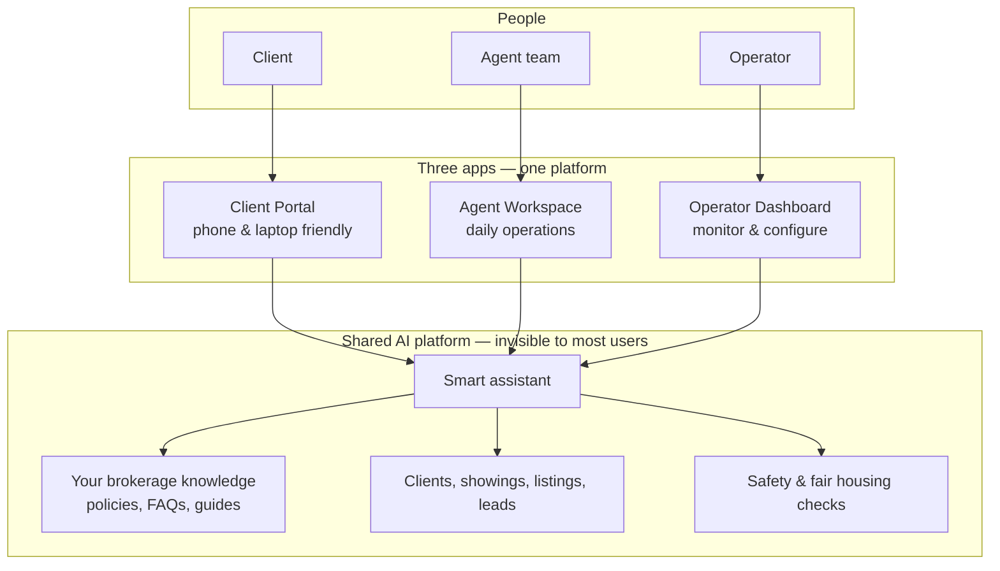
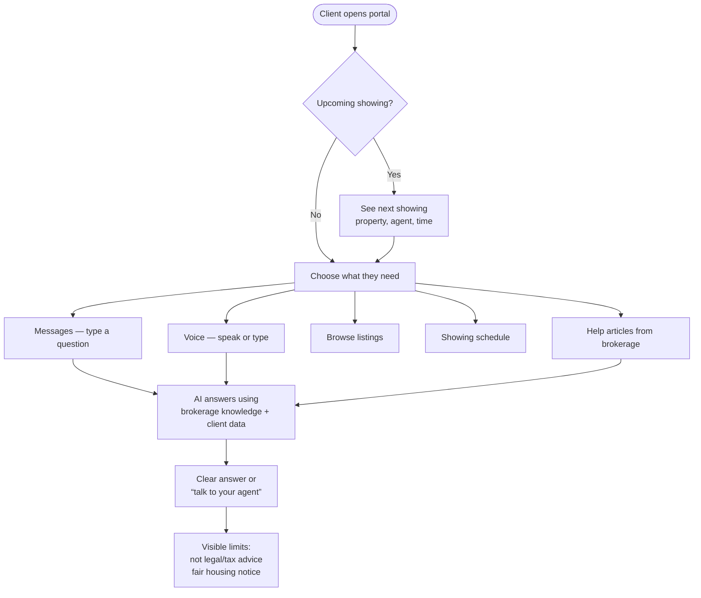
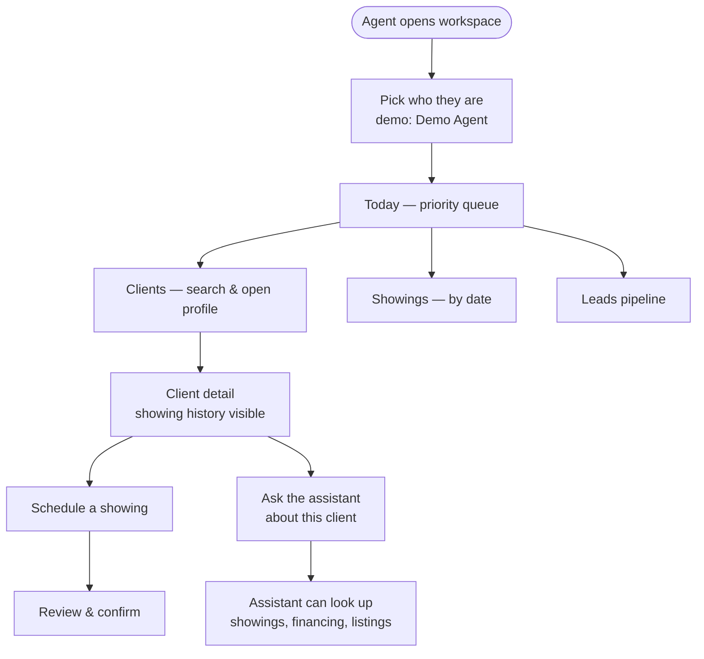
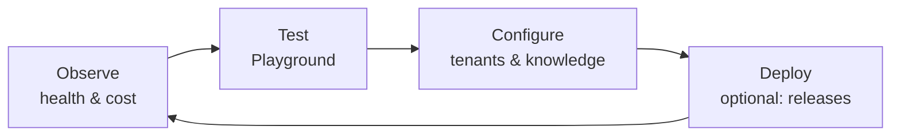
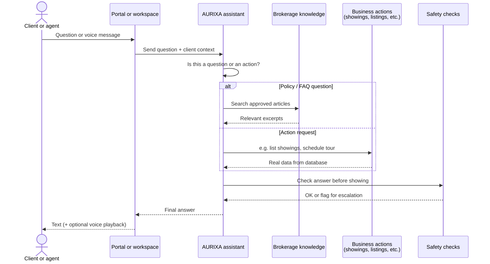
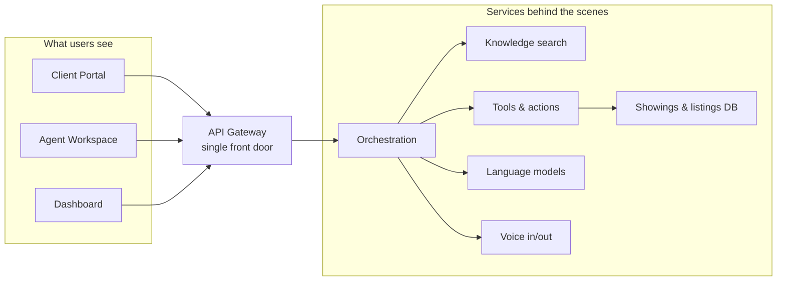

# AURIXA Demo Presentation Guide

**Audience:** Executives, brokerage leaders, product stakeholders, and mixed technical/non-technical rooms  
**Duration:** 15–20 minutes live demo + 5 minutes Q&A  
**Local URLs:** Client portal `http://localhost:3300` · Agent workspace `http://localhost:3400` · Operator dashboard `http://localhost:3100`

---

## What to say in one sentence

**AURIXA is a single platform where clients get self-service help, agents get a shared workspace, and operators can see and test everything—powered by one AI assistant that knows your brokerage’s policies and can take action (like looking up showings), with safety checks built in.**

---

## The three people in every demo

Think of three roles—most brokerages already have all three:

| Role | Who they are | What they care about |
|------|----------------|----------------------|
| **Client** | Buyer, renter, or seller using your brand | “When is my showing?” “What listings fit my budget?” “What’s my next step?” |
| **Agent / coordinator** | Licensed staff running the day | Client context, today’s showings, leads, scheduling, quick answers |
| **Operator** | IT, ops, or platform owner | Is it healthy? What does it cost? Can we trust the answers? Can we roll it out safely? |

AURIXA gives **each role their own app**, but they all share the **same brain** underneath.

---

## Big picture (non-technical)

**Talking point:** “We’re not selling three separate products. One platform serves clients, staff, and operators—and the assistant always uses the same approved knowledge and the same business data.”

---

## Client journey (what the buyer/renter sees)

**Demo story:** *Jane Smith* (demo client #1) has a confirmed showing tomorrow at **123 Oak Street** with agent **Alex Rivera**.

**Talking points:**
- Clients see **plain language**, not internal jargon.
- The home screen answers **“What do I need today?”** first.
- Chat and voice use the **same assistant**—voice is optional for demos.
- When data isn’t connected, pages say so honestly (no fake balances or fake listings).

---

## Agent journey (what staff see)

**Demo story:** Harbor Realty Group — agents **Alex Rivera**, **Jordan Lee**, coordinator **Sam Ortiz**. Demo login uses **Demo Agent** (`demo-agent@localhost`).

**Talking points:**
- Agents don’t hunt through five systems for “who is this client and what’s next?”
- Role context changes **what’s prioritized** (agent vs coordinator)—production permissions come later.
- Scheduling and client records are **real in the demo database**, not mocked UI.

---

## Operator journey (what platform/IT sees)

**Talking points:**
- **Playground** is your “proof it works” screen—one click tests services.
- **Analytics** shows clients, showings, listings, leads—not generic IT metrics only.
- **Tenants** = separate brokerages on the same platform (Harbor Realty, Urban Living PM, Summit Homes in seed data).
- **Audit** supports “who did what” for compliance conversations later.

---

## What happens when someone asks the assistant? (simple version)

**Talking points:**
- The assistant **doesn’t guess** listing or showing data—it reads what’s in the system (demo DB today; MLS/CRM later).
- **Fair housing and fraud language** can trigger escalation flags—not a replacement for training, but a guardrail.
- Organizations **author knowledge**; the AI cites that content instead of inventing policy.

---

## How the platform is built (for technical guests — optional slide)

**One-liner:** “Microservices behind one gateway—so we can scale, swap AI providers, and deploy safely.”

---

## Demo script (15 minutes)

### Before you start (2 min)

1. Stack running: `./scripts/docker-up.sh` or existing Docker containers healthy.
2. Optional for live AI answers: **LM Studio** on port 1234, or a configured cloud API key.
3. Open three browser tabs: **3300**, **3400**, **3100/playground**.

**Say:** “Everything you’ll see is running locally with sample brokerage data—Harbor Realty Group and a few other orgs—so we can show the full journey without a production MLS contract.”

---

### Act 1 — Client (5 min)

| Step | Do | Say |
|------|-----|-----|
| 1 | Go to `localhost:3300/auth/signin` → **Continue with local demo** | “Jane Smith is our sample buyer. She signs in the way a client would after SSO in production.” |
| 2 | Home page | “First question we optimize for: what does she need today? She sees her **next showing** if one exists.” |
| 3 | **Showings** | “Upcoming tour at Oak Street—agent, time, status. Same data the agent sees.” |
| 4 | **Listings** | “Active inventory for the brokerage—not a generic internet search; org-scoped.” |
| 5 | **Messages / Chat** | Ask: *“When is my next showing?”* or *“What should I bring to a showing?”* | “The assistant can **look up** her showing or **answer from Harbor’s knowledge base**.” |
| 6 | (Optional) **Voice** | “Same brain; she can speak and hear the reply. Great for mobile-style demos.” |

---

### Act 2 — Agent (5 min)

| Step | Do | Say |
|------|-----|-----|
| 1 | Go to `localhost:3400/auth/signin` → demo agent | “Now the agent’s view—same organization, shared data.” |
| 2 | **Today** | “Ranked queue—what matters this morning.” |
| 3 | **Clients** → open **Jane Smith** | “Full context: identity, preferences, showing history on one screen.” |
| 4 | **Showings** or **Schedule** | “Coordinate tours without leaving the workspace.” |
| 5 | **Leads** | “Pipeline for prospects—not yet clients.” |
| 6 | **Chat** (assistant) | Ask: *“Summarize Jane’s upcoming showings.”* | “Contextual help for staff—not a separate ChatGPT tab.” |

---

### Act 3 — Operator (3 min)

| Step | Do | Say |
|------|-----|-----|
| 1 | `localhost:3100/playground` → **Run All Tests** | “Before we trust a demo—or after every deploy—we verify every service.” |
| 2 | **Analytics** | “Clients, showings, listings, leads—operational metrics leaders care about.” |
| 3 | **Tenants** | “Multi-tenant: Harbor Realty, property manager, developer sales—one platform, separated data.” |
| 4 | (Optional) Execution actions in Playground | “`get_showings`, `create_showing`—the assistant’s actions hit real database workflows.” |

---

### Close (2 min)

**Say:** “Today we showed self-service for clients, coordination for agents, and observability for operators—on one AI layer with your knowledge and your data. Production next steps are your MLS/CRM calendars and SSO; the demo runs on seeded data and local auth.”

---

## Talking points cheat sheet

### Opening (pick 2–3)

- **Problem:** Clients call for showings, listings, and “what’s next?” Agents re-type the same answers. Knowledge lives in PDFs and email.
- **Solution:** One branded portal + agent workspace + governed assistant tied to **your** articles and **your** records.
- **Differentiator:** Not a generic chatbot widget—it **routes** questions vs **actions**, logs activity, and flags fair housing / fraud language.
- **Who it’s for:** Residential brokerages, property managers, developer sales offices—multi-tenant from day one.

### During client demo

- Warm, calm UI—designed for stress-free transaction navigation.
- Clear **disclaimers**: assistant is not legal, tax, or fair housing advice.
- Honest empty states when integrations aren’t wired.

### During agent demo

- “Same client record the client sees—no swivel-chair between CRM, email, and chat.”
- Leads → clients → showings → deals is the long-term arc; demo focuses on showings + leads.
- Coordinator vs agent views prioritize different menus (scheduling vs pipeline).

### During operator demo

- Playground = living proof for security and IT reviewers.
- Cost and latency telemetry for AI governance conversations.
- Deployment controller exists for staged releases (mention only if audience cares about DevOps).

### Objection handlers

| Question | Short answer |
|----------|----------------|
| “Is this replacing our agents?” | No—**decision support** and routine self-service. Escalation to licensed professionals stays explicit. |
| “Where do listings come from?” | Demo uses seeded data; production uses **manual entry, CSV, or MLS (RESO)** adapters. |
| “HIPAA / healthcare?” | Platform was rebuilt for **real estate**—fair housing, wire fraud, and transaction disclaimers instead of clinical triage. |
| “Which AI model?” | **Pluggable**—local (LM Studio) or cloud (OpenAI, Anthropic, Gemini). You control cost and data residency. |
| “Is it secure for production?” | Demo uses local auth. Production path: **SSO per portal**, encrypted integration credentials, audit logs—RBAC enforcement is on the roadmap post-demo. |

---

## Sample demo data (seed)

| Item | Value |
|------|--------|
| **Primary org** | Harbor Realty Group |
| **Demo client** | Jane Smith (buyer), client ID 1 |
| **Next showing** | ~tomorrow, 123 Oak Street, agent Alex Rivera |
| **Listings** | e.g. “Charming 3BR Craftsman” ($485k), “Modern townhouse” ($625k) |
| **Other orgs** | Urban Living PM (rentals), Summit Homes Development (new construction) |
| **Demo agent login** | Agent workspace → local demo → Demo Agent |

---

## What we intentionally don’t demo yet

Keep expectations clear—builds trust with technical and non-technical audiences:

- Real **MLS / CRM / calendar** sync (documented, not wired in demo)
- **Phone calls (PSTN)**—web voice only
- **SMS / WhatsApp** channels
- Production **SSO** and fine-grained **permissions**
- **Billing / subscriptions**

---

## Diagram index

| Diagram | Use when |
|---------|----------|
| Big picture (three apps + shared brain) | Opening slide; non-technical execs |
| Client journey | Walk through client portal |
| Agent journey | Walk through agent workspace |
| Operator loop | Dashboard / IT audience |
| Assistant sequence | “How does AI work?” without jargon |
| Architecture (optional) | Engineering or security deep-dive |

---

## Related docs

- [Real Estate Domain Specification](./REAL_ESTATE_DOMAIN.md) — full product vocabulary
- [Streaming & End-User Flows](./STREAMING_AND_END_USER_FLOWS.md) — voice and chat mechanics
- [End-User Flow & Telephony](./END_USER_FLOW_AND_TELEPHONY.md) — channels and future phone integration
- [README](../README.md) — technical quick start

---

## Quick checklist

- [ ] Docker stack up (`docker ps` shows `client-portal`, `agent-workspace`, `dashboard`)
- [ ] `./scripts/e2e-check.sh` passes (pipeline warning OK if no LLM)
- [ ] Three tabs open: 3300, 3400, 3100/playground
- [ ] Demo sign-in works on both portals
- [ ] One chat prompt prepared: *“When is my next showing?”*
- [ ] One agent prompt prepared: *“What showings does Jane Smith have?”*
- [ ] Playground **Run All Tests** ready for the “trust” moment
