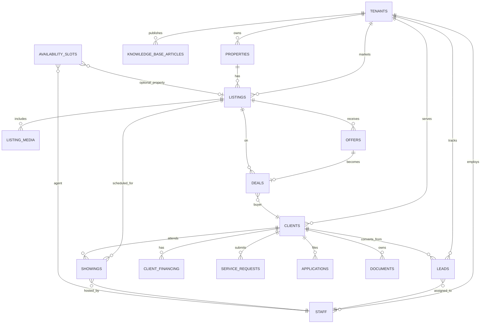
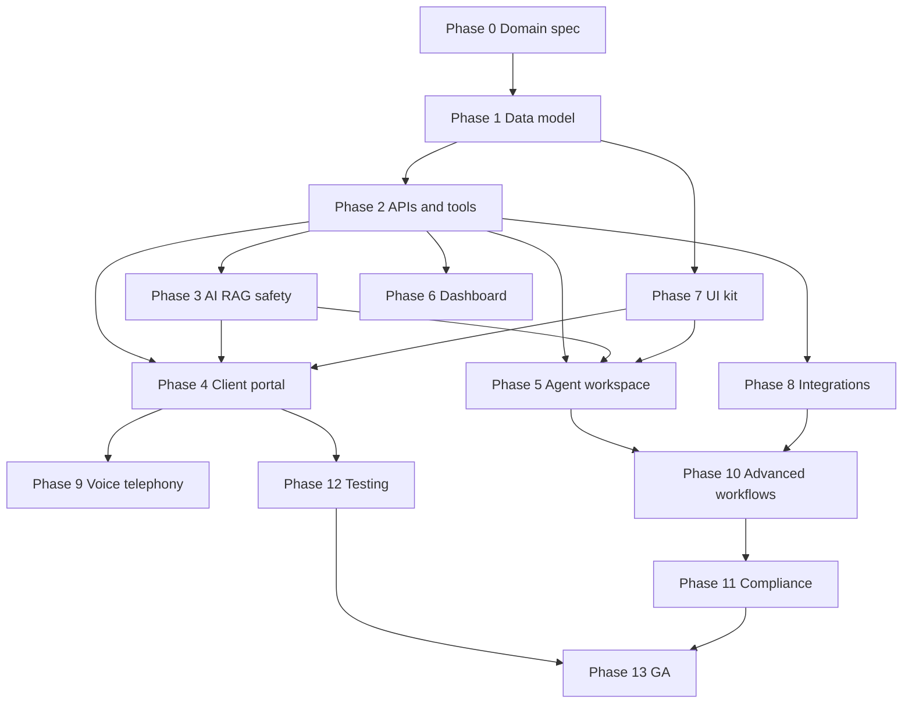

# AURIXA Real Estate Domain Specification (Phase 0)

**Status:** Approved for implementation planning  
**Branch:** `feature/real-estate-phase-0`  
**Replaces:** Healthcare domain model documented in README and `packages/db`  
**Audience:** Engineering, product, compliance stakeholders

---

## 1. Purpose

This document is the **single source of truth** for pivoting AURIXA from a healthcare conversational care platform to a **real estate conversational operations platform**.

Phase 0 locks:

- Domain vocabulary and entity boundaries
- Target data model (schema direction)
- Role taxonomy and permissions
- Pipeline stages by business segment
- Integration boundaries (what AURIXA owns vs external systems)
- Rename and migration strategy

**No application code changes in Phase 0** — only specifications that Phase 1+ implement against.

---

## 2. Product definition (target state)

**AURIXA for Real Estate** is a multi-tenant SaaS that gives:

| Surface | Users | Purpose |
| --- | --- | --- |
| **Client Portal** | Buyers, renters, sellers, owners | Self-service: listings, showings, documents, chat/voice, applications |
| **Agent Workspace** | Agents, brokers, leasing coordinators, property managers | Daily operations: leads, clients, showings, deals, maintenance, assistant |
| **Operator Console** | Platform admins, brokerage ops, content owners | Tenants, audit, knowledge, analytics, deployments, compliance |

**Platform core (unchanged architecturally):** API gateway → orchestration → LLM router, agent runtime, RAG, execution tools, safety, streaming voice, observability, deployment controller.

**Positioning:** Decision-support and workflow automation — not a licensed broker, attorney, or fair-housing compliance officer. Organizations remain responsible for listings accuracy, legal review, and regulatory compliance.

---

## 3. Locked architecture decisions

| # | Decision | Choice | Rationale |
| --- | --- | --- | --- |
| D1 | **System of record** | AURIXA owns clients, showings, leads, listings (operational data); syncs bidirectionally with CRM/MLS where configured | Full product value requires native records; integrations are adapters |
| D2 | **Listing source** | Manual CRUD + CSV import in Phase 1–2; RESO/MLS feed adapter in Phase 8 | Unblocks development without MLS contract dependency |
| D3 | **Segments in scope** | Residential buy/sell, property management, developer sales — all three in target schema; residential + PM first in build order | Shared entities (client, showing, listing) with segment-specific extensions |
| D4 | **Auth (production)** | Separate OIDC per portal: Client Portal SSO, Agent Workspace SSO; demo auth for local dev only | Mirrors current PATIENT_/STAFF_ split |
| D5 | **Compliance scope (v1)** | Fair housing language guardrails, legal/tax advice disclaimers, fraud/wire-scam escalation, PII redaction, audit retention | Replace clinical triage with RE-specific safety policies |
| D6 | **Migration strategy** | Greenfield schema rename via Alembic migrations; no in-place healthcare customer migration (no healthcare prod customers assumed) | Clean break; seed data replaced entirely |
| D7 | **Package rename timing** | Document now; rename `patient-portal` → `client-portal`, `hospital-portal` → `agent-workspace` in Phase 4–5 | Avoid breaking Docker/Helm until coordinated |

---

## 4. Glossary

### 4.1 Core nouns

| Term | Definition | Notes |
| --- | --- | --- |
| **Organization** | A tenant on the platform: brokerage, PM company, or developer sales office | Replaces “hospital/clinic” tenant framing; table may remain `tenants` internally |
| **Client** | An end person the organization serves: buyer, renter, seller, or owner | Replaces **Patient**; one record per person per org |
| **Lead** | A prospective client before conversion or assignment; has source and pipeline stage | May link to `client_id` when converted |
| **Staff** | Employee of an organization: agent, broker, coordinator, PM, admin | Replaces clinical staff roles |
| **Property** | Physical asset: address, geo, beds/baths, sqft, type | New entity; not in healthcare model |
| **Listing** | Marketed offer for a property: sale or rent price, status, marketing copy, media | Linked to property; may sync from MLS |
| **Showing** | Scheduled interaction: private tour, open house, inspection, closing, move-in | Replaces **Appointment** |
| **Deal** | Transaction lifecycle from offer through close | Residential buy/sell primary use |
| **Offer** | Formal purchase offer on a listing | Sub-entity of deal workflow |
| **Application** | Rental or purchase application with document checklist | PM and residential |
| **Client financing** | Pre-approval, lender, amount, deposit terms | Replaces **Patient insurance** pattern |
| **Service request** | Maintenance, lease renewal, or follow-up ticket | Replaces **Prescription/refill** pattern |
| **Knowledge article** | Org-authored content for RAG: policies, FAQs, neighborhood guides | Existing entity; new content domain |
| **Availability slot** | Agent or property window open for booking | Existing entity; `provider_name` → `agent_name` |

### 4.2 Disambiguation

| Pair | Distinction |
| --- | --- |
| **Lead vs Client** | Lead = pipeline record with stage/source; Client = identity record. Lead converts to client or links to existing client |
| **Showing vs Open house** | Open house is a showing **type** with multiple attendees allowed |
| **Deal vs Transaction** | “Deal” is the platform term; “transaction” is user-facing synonym in copy only |
| **Listing vs Property** | Property = asset; Listing = marketed instance (property can have listing history) |
| **Agent vs Staff** | Agent is a staff **role**; Staff is the table/entity for all org employees |
| **Tenant (DB) vs Renter** | DB `tenants` = organization; “renter” = client type — avoid “tenant” in user-facing RE copy for people |

### 4.3 User-facing copy conventions

- Say **client**, not patient  
- Say **showing** or **tour**, not appointment (appointment acceptable in agent-internal tools briefly during migration)  
- Say **organization** or brokerage name, not hospital  
- Say **agent workspace**, not clinical workspace  
- Say **fair housing notice**, not medical disclaimer  
- Never use **tenant** for a renter in UI — use **renter** or **client**

---

## 5. Entity map: healthcare → real estate

### 5.1 Database tables

| Current (healthcare) | Target (real estate) | Action |
| --- | --- | --- |
| `tenants` | `tenants` (org types: brokerage, pm, developer) | Extend metadata; update seeds/copy |
| `patients` | `clients` | Rename table + FKs |
| `patient_insurance` | `client_financing` | Rename; remap fields |
| `prescriptions` | `service_requests` | Rename; expand types |
| `appointments` | `showings` | Rename; add `listing_id`, `showing_type` |
| `availability_slots` | `availability_slots` | Rename `provider_name` → `agent_name`; optional `listing_id` |
| `staff` | `staff` | New role enum |
| `knowledge_base_articles` | `knowledge_base_articles` | Same table; RE content |
| `conversations` | `conversations` | Metadata: `client_id`, `listing_id`, `showing_id` |
| — | `properties` | **New** |
| — | `listings` | **New** |
| — | `listing_media` | **New** |
| — | `leads` | **New** |
| — | `pipeline_stages` | **New** (config per org) |
| — | `applications` | **New** |
| — | `offers` | **New** |
| — | `deals` | **New** |
| — | `documents` | **New** |
| `users`, `audit_logs`, `platform_config`, deployment_* | unchanged | Domain-agnostic |

### 5.2 Field remapping (high-signal)

**clients** (ex-patients)

| Old | New |
| --- | --- |
| `full_name`, `email`, `phone_number` | unchanged |
| — | `client_type`: buyer \| renter \| seller \| owner |
| — | `preferences`: JSON (areas, budget, beds, pets) |

**showings** (ex-appointments)

| Old | New |
| --- | --- |
| `patient_id` | `client_id` |
| `provider_name` | `agent_name` |
| `reason` | `notes` |
| `status`: confirmed, checked_in, in_room… | confirmed, cancelled, completed, no_show |
| — | `listing_id` (FK) |
| — | `showing_type`: private_tour, open_house, inspection, closing, move_in |

**client_financing** (ex-patient_insurance)

| Old | New |
| --- | --- |
| `plan_name` | `program_name` (e.g. “Conventional 30-year”) |
| `payer` | `lender` |
| `member_id` | `reference_id` |
| `copay` | `deposit_amount` or `down_payment_pct` |
| `status` | pre_approved, pending, denied, expired |

**service_requests** (ex-prescriptions)

| Old | New |
| --- | --- |
| `medication_name` | `title` / `category` |
| `refill_requested` | `maintenance`, `lease_renewal`, `application_follow_up` |
| `refill_requested_at` | `requested_at` |

**staff.roles**

| Healthcare | Real estate |
| --- | --- |
| reception | leasing_coordinator |
| nurse, doctor, clinician | agent, broker |
| scheduler | showing_coordinator |
| admin | admin |

---

## 6. Target schema (ER overview)

Full column definitions: see Phase 1 Alembic migrations. This diagram defines **relationships only**.

---

## 7. Role taxonomy and permissions

### 7.1 Staff roles

| Role | Category | Primary surfaces |
| --- | --- | --- |
| `agent` | sales | Today, clients, leads, showings, listings, deals, assistant |
| `broker` | sales | Same as agent + team visibility |
| `leasing_coordinator` | coordination | Schedule, applications, showings, clients |
| `showing_coordinator` | coordination | Showings, availability, calendar |
| `property_manager` | operations | Maintenance, clients (renters), leases, properties |
| `admin` | operations | Full workspace + org settings |
| `support` | operations | Read-only diagnostics, audit |

**Workspace role categories** (UI nav grouping — replaces `clinical` / `coordination` / `operations`):

| Category | Roles |
| --- | --- |
| `sales` | agent, broker |
| `coordination` | leasing_coordinator, showing_coordinator |
| `operations` | property_manager, admin, support |

### 7.2 Permission matrix (summary)

| Action | Agent | Coordinator | PM | Admin |
| --- | --- | --- | --- | --- |
| View org clients | own + assigned | yes | yes (renters) | yes |
| Create/edit listings | yes | read | read | yes |
| Book showing | yes | yes | limited | yes |
| Update deal/offer | yes | no | no | yes |
| Maintenance requests | read | read | full | yes |
| Knowledge CMS | read | read | read | write |
| Platform config | no | no | no | yes (via dashboard) |
| Audit export | no | no | no | yes |

Fine-grained RBAC enforcement: Phase 11. Phase 0 defines intent.

### 7.3 Client portal access

Clients authenticate via org SSO or demo auth. Scoped to:

- Own profile, showings, applications, documents, service requests
- Public listing browse (org-scoped)
- Conversations tied to `client_id`

---

## 8. Pipeline stages by segment

### 8.1 Residential buy/sell (leads)

`new` → `contacted` → `qualified` → `showing_scheduled` → `showing_completed` → `offer_submitted` → `under_contract` → `closed` → `lost`

### 8.2 Property management (leads → renters)

`inquiry` → `tour_scheduled` → `tour_completed` → `application_started` → `application_submitted` → `approved` → `lease_signed` → `moved_in` → `lost`

### 8.3 Developer sales

`inquiry` → `model_home_scheduled` → `model_home_completed` → `reservation` → `under_contract` → `closed` → `lost`

Stages are **configurable per organization** via `pipeline_stages` table (Phase 1). Above are defaults seeded per org type.

---

## 9. API surface (target naming)

Base path unchanged: `/api/v1/admin/*` (staff/operator), client BFF `/api/client/*`.

| Healthcare (current) | Real estate (target) |
| --- | --- |
| `GET/POST /patients` | `GET/POST /clients` |
| `GET /patients/:id` | `GET /clients/:id` |
| `GET /patients/:id/appointments` | `GET /clients/:id/showings` |
| `GET /patients/:id/conversations` | `GET /clients/:id/conversations` |
| `GET/POST/PATCH /appointments` | `GET/POST/PATCH /showings` |
| `GET /staff` | `GET /staff` (new role filter) |
| — | `GET/POST/PATCH /properties` |
| — | `GET/POST/PATCH /listings` |
| — | `GET/POST/PATCH /leads` |
| — | `PATCH /leads/:id/stage` |
| — | `GET/POST /applications` |
| — | `GET/POST/PATCH /offers` |
| — | `GET/POST/PATCH /deals` |
| — | `GET/POST/PATCH /service-requests` |
| — | `GET/POST /documents` |

**Execution tools (target):**

| Healthcare tool | Real estate tool |
| --- | --- |
| `get_appointments` | `get_showings` |
| `create_appointment` | `create_showing` |
| `get_availability` | `get_availability` |
| `check_insurance` | `get_client_financing` |
| `request_prescription_refill` | `create_service_request` |
| — | `get_listings`, `get_listing_detail` |
| — | `create_lead`, `update_lead_stage` |
| — | `get_deal_status`, `submit_offer` |

Detail: [`REAL_ESTATE_API_CONVENTIONS.md`](./REAL_ESTATE_API_CONVENTIONS.md)

---

## 10. AI layer (target)

### 10.1 LLM intents (replace healthcare)

`showing`, `availability`, `listing_search`, `listing_detail`, `financing`, `application`, `offer`, `maintenance`, `neighborhood`, `policy`, `billing_fees`

### 10.2 System prompt persona

- **Client channel:** helpful real estate guide; no legal/tax advice; fair-housing neutral language  
- **Agent channel:** operational assistant; cite listing/KB sources; suggest next actions  

### 10.3 Safety policies (replace clinical triage)

| Policy | Trigger | Action |
| --- | --- | --- |
| `fair_housing_violation` | Steering, discriminatory preferences | Block/sanitize; flag audit |
| `legal_escalation` | Contract interpretation, legal advice | Disclaim; escalate |
| `fraud_escalation` | Wire transfer urgency, scam patterns | Escalate immediately |
| `pii_exposure` | SSN, account numbers in logs | Redact (existing) |

---

## 11. Integration boundaries

AURIXA **owns:** clients, leads, showings, listings (when not MLS-mastered), conversations, knowledge, audit.

**Syncs with external systems** (Phase 8):

| System | Direction | Data |
| --- | --- | --- |
| CRM (HubSpot, FUB, Salesforce) | Bi-directional | leads, contacts, activities |
| MLS / RESO | Inbound | listings, photos, status |
| Calendar (Google, M365) | Bi-directional | showing events, availability |
| PM (AppFolio, Buildium) | Bi-directional | units, work orders |
| E-sign (DocuSign) | Outbound + webhook | application, lease status |

Detail: [`REAL_ESTATE_INTEGRATIONS.md`](./REAL_ESTATE_INTEGRATIONS.md)

---

## 12. Rename inventory (summary)

Full file-level mapping: [`REAL_ESTATE_RENAME_INVENTORY.md`](./REAL_ESTATE_RENAME_INVENTORY.md)

### 12.1 Packages and folders (Phase 4–5)

| Current | Target |
| --- | --- |
| `frontend/patient-portal` | `frontend/client-portal` |
| `frontend/hospital-portal` | `frontend/agent-workspace` |
| `@aurixa/patient-portal` | `@aurixa/client-portal` |
| `@aurixa/hospital-portal` | `@aurixa/agent-workspace` |

### 12.2 Environment variables (Phase 1–4)

| Current | Target |
| --- | --- |
| `PATIENT_*` | `CLIENT_*` |
| `PATIENT_OIDC_*` | `CLIENT_OIDC_*` |
| `HOSPITAL_OIDC_*` | `WORKSPACE_OIDC_*` |
| `STAFF_*` | `STAFF_*` (retain) or `AGENT_*` (optional alias) |
| `DEPLOYMENT_ALLOWED_SERVICES` … `patient-portal`, `hospital-portal` | `client-portal`, `agent-workspace` |

### 12.3 UI themes

| Current | Target |
| --- | --- |
| `data-theme="patient"` | `data-theme="client"` |
| `data-theme="clinical"` | `data-theme="workspace"` |
| `Healthcare.tsx` | `RealEstateDisclaimers.tsx` |

### 12.4 Docker / Helm hosts

| Current | Target |
| --- | --- |
| `patient.aurixa.local` | `client.aurixa.local` |
| `hospital.aurixa.local` | `workspace.aurixa.local` |

---

## 13. Migration strategy

1. **Phase 1:** Alembic migration chain renames tables/columns; new tables added; seed replaced  
2. **No dual-read period** — healthcare demo data discarded on migrate  
3. **Feature flags:** `DOMAIN_REAL_ESTATE=true` optional during transition (Phase 2–3) if parallel paths needed; removed before GA  
4. **CI gate (Phase 10):** `pnpm run check:domain-copy` blocks merge if healthcare terms appear in user-facing frontend paths  

---

## 14. Phase dependency chart

---

## 15. Phase 0 exit criteria

- [x] Domain glossary and disambiguation documented  
- [x] Healthcare → real estate entity map complete  
- [x] Target ER diagram defined  
- [x] Role taxonomy and permission intent documented  
- [x] Pipeline stages defined per segment  
- [x] Architecture decisions locked (Section 3)  
- [x] API and tool naming conventions documented  
- [x] Integration boundaries documented  
- [x] Rename inventory published  
- [x] Migration strategy documented  

## 16. Phase 1 status

- [x] `packages/db` models rewritten for real estate domain  
- [x] Alembic migration `20260811_0002_real_estate_domain`  
- [x] `seed.py` replaced with brokerage, PM, and developer demo data  
- [x] Backward-compat aliases (`Patient`, `Appointment`, etc.) for Phase 2 transition  

### Phase 2 status

- [x] Gateway admin routes: `/clients`, `/showings`, `/listings`, `/properties`, `/leads` + legacy aliases
- [x] Orchestration `admin_api.py` with full RE CRUD and legacy `/patients`, `/appointments`
- [x] Execution engine tools: `get_showings`, `create_showing`, `get_listings`, `get_client_financing`, etc.
- [x] Agent runtime keyword → RE tool mapping
- [x] Pipeline `client_id` metadata (+ legacy `patient_id`)
- [x] Real estate system prompt in orchestration LLM client

### Phase 3 status

- [x] LLM router semantic intents: `showing`, `listing_search`, `financing`, `maintenance`, `policy`, etc.
- [x] RAG fallback documents rewritten for real estate (showings, fair housing, rental apps)
- [x] Safety guardrails: `fair_housing_violation`, `legal_escalation`, `fraud_escalation`, `property_emergency`
- [x] Client + agent channel system prompts; pipeline input/output validation with RE escalation notices
- [x] `.env.example` documents `SAFETY_*` real estate policy keywords

### Phase 4 status

- [x] `frontend/patient-portal` → `frontend/client-portal` (`@aurixa/client-portal`)
- [x] Client session/auth: `CLIENT_*` env vars with `PATIENT_*` legacy fallback
- [x] BFF `/api/client/*` → admin `/clients`, `/showings`, `/listings`; legacy `/api/patient/*` re-export
- [x] Nav and pages: showings, listings, applications, financing, maintenance
- [x] Redirects from `/appointments`, `/billing`, `/medications`, etc.
- [x] Docker, CI, Helm, deployment registry updated

### Phase 5 status

- [x] `frontend/hospital-portal` → `frontend/agent-workspace` (`@aurixa/agent-workspace`)
- [x] BFF `/api/workspace/*` with RE resources (clients, showings, leads, listings); legacy `/api/hospital/*` re-export
- [x] Routes: `/clients`, `/showings`, `/leads`; redirects from `/patients`, `/appointments`
- [x] Agent role categories (`agent`, `coordination`, `operations`); demo agent identity
- [x] Docker, CI, Helm, deployment registry updated

### Phase 6 status

- [x] Dashboard API client: `/admin/clients`, RE analytics fields (`clients_count`, `showings_count`, `listings_count`, `leads_count`)
- [x] Analytics page: RE metric labels and entity distribution charts
- [x] Playground: RE sample prompts, client context, execution actions (`get_showings`, `create_showing`, etc.)
- [x] Operator guide rewritten for brokerages and real estate operations
- [x] Overview domain strip (clients, showings, listings, leads)

### Phase 7 status

- [x] `RealEstateDisclaimer` in `@aurixa/ui-kit` (`RealEstate.tsx`)
- [x] `HealthcareDisclaimer` deprecated with variant mapping to real estate copy
- [x] Primary themes documented: `client`, `workspace`, `operator` (legacy `patient` / `clinical` aliases)
- [x] `ChatPanel` variants: `client` / `workspace`; `AppointmentCard` default event label "Showing"
- [x] Portal duplicate disclaimer components removed; imports from ui-kit
- [x] Storybook theme toolbar updated for real estate product names

**Next phase:** Phase 11 — Advanced workflows and telephony (per dependency chart).

### Phase 10 status

- [x] `scripts/check-real-estate-domain-copy.sh` — CI gate for banned healthcare product copy in frontends
- [x] `pnpm run check:domain-copy` wired into `.github/workflows/tests.yml`
- [x] Client portal legacy pages updated (documents, billing, records, help, notifications, etc.)
- [x] Audit docs refreshed: `ARCHITECTURE_AUDIT.md`, `FEATURE_GAP_ANALYSIS.md`, `END_USER_FLOW_AND_TELEPHONY.md`, `OPTIMIZATION_AUDIT.md`

### Phase 9 status

- [x] `README.md` — product overview, assistant use cases, experiences, architecture, features, monorepo, quick start
- [x] `docs/TECHNICAL_DOCUMENTATION.md` — client layer, frontends, tools, schema, API examples
- [x] `docs/STREAMING_AND_END_USER_FLOWS.md` — client and agent end-user flows

### Phase 8 status

- [x] Helm ingress hosts: `client.*` / `workspace.*` (dev, staging, prod overlays)
- [x] Docker Compose demo env uses `CLIENT_DEMO_*` only (no duplicate `PATIENT_DEMO_*`)
- [x] `DEPLOYMENT_ALLOWED_SERVICES` and deployment registry use `client-portal`, `agent-workspace`
- [x] `scripts/run-stack.sh`, `e2e-check.sh`, `e2e-detailed.sh` updated for RE services
- [x] `docs/FRONTEND_AUTH.md` and `infra/DEPLOYMENT.md` host documentation updated

---

## 18. Document index

| Document | Purpose |
| --- | --- |
| This file | Master domain specification |
| [`README.md`](../README.md) | Product overview and quick start (real estate) |
| [`REAL_ESTATE_API_CONVENTIONS.md`](./REAL_ESTATE_API_CONVENTIONS.md) | REST paths, payloads, tool contracts |
| [`REAL_ESTATE_INTEGRATIONS.md`](./REAL_ESTATE_INTEGRATIONS.md) | External system adapters and events |
| [`REAL_ESTATE_RENAME_INVENTORY.md`](./REAL_ESTATE_RENAME_INVENTORY.md) | File-by-file healthcare term mapping |
