# AURIXA Real Estate — Product Overview

**Audience:** Executives, brokerage leaders, investors, product stakeholders, and non-technical evaluators  
**Branch:** `feature/real-estate`  
**Related:** [Real Estate Domain Spec](./REAL_ESTATE_DOMAIN.md) · [Demo Presentation](./DEMO_PRESENTATION.md) · [Integrations Roadmap](./REAL_ESTATE_INTEGRATIONS.md)

---

## In one sentence

**AURIXA is a multi-tenant SaaS platform that gives real estate clients a branded self-service portal, gives agents a shared operations workspace, and gives platform operators full visibility—unified by one governed AI assistant that answers from your brokerage’s knowledge and can take action on showings, listings, leads, and maintenance using your live data.**

---

## What this product does (real estate domain)

AURIXA replaces a patchwork of disconnected chat widgets, CRM tabs, email threads, and PDF policy binders with **one coordinated layer** across the transaction journey:

| Capability | What it means in practice |
| --- | --- |
| **Client self-service** | Buyers and renters see upcoming tours, browse org listings, compare properties, ask questions 24/7, and submit maintenance or application requests—without waiting on hold. |
| **Agent coordination** | Licensed staff get a single workspace for today’s priorities, client profiles, showings, leads, and an in-context assistant—without copying context into a generic AI tab. |
| **Operator control** | IT and brokerage ops monitor health, audit activity, curate knowledge, run end-to-end tests, and (in production deployments) manage staged releases. |
| **Governed AI** | Every answer routes through intent detection, optional knowledge retrieval (RAG), registered business tools, fair-housing and fraud guardrails, and cost/latency telemetry. |
| **Multi-tenant by design** | One platform hosts multiple brokerages, property managers, or developer sales offices with separated data (e.g. Harbor Realty Group, Urban Living PM, Summit Homes in demo seed). |

AURIXA is **decision-support and workflow automation**—not a licensed broker, attorney, or fair-housing compliance officer. Organizations remain responsible for listing accuracy, contract review, and regulatory compliance.

---

## Target audience (who this SaaS is for)

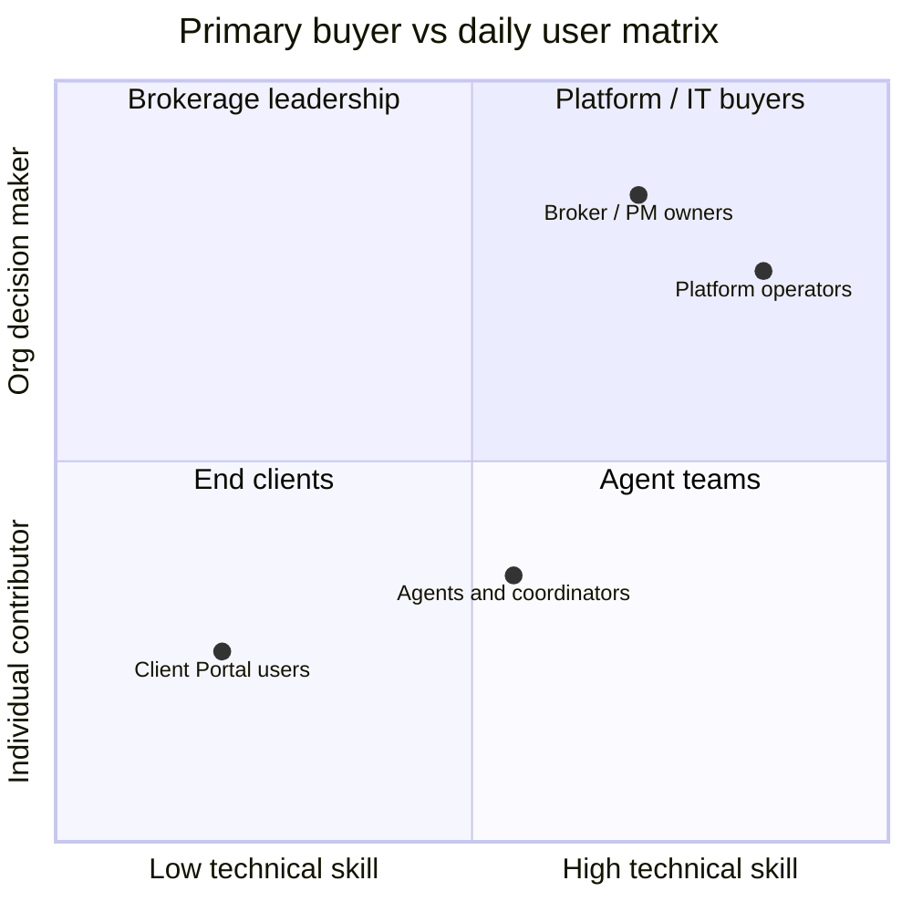

### Primary customers (who pays)

| Segment | Examples | Why they buy |
| --- | --- | --- |
| **Residential brokerages** | Independent brokerages, franchise offices | Reduce repetitive client calls; unify client experience under their brand |
| **Property management companies** | Multifamily operators, residential PM | Self-service for renters; maintenance and tour coordination |
| **Developer sales offices** | New-construction sales teams | Model-home scheduling, lead nurture, buyer education at scale |
| **Prop-tech / platform operators** | White-label or multi-brand operators | One deployable stack with tenant isolation and observability |

### Daily users (who logs in)

| Role | Portal | Typical job |
| --- | --- | --- |
| **Buyer, renter, seller, owner** | Client Portal | “When is my tour?” “What fits my budget?” “What’s my next step?” |
| **Agent, broker** | Agent Workspace | Client context, showings, leads, deal support |
| **Leasing / showing coordinator** | Agent Workspace | Scheduling-heavy queue, applications, availability |
| **Property manager** | Agent Workspace | Maintenance requests, renter clients, operational tickets |
| **Platform admin, content owner, IT** | Operator Dashboard | Health, knowledge, analytics, audit, configuration |

---

## The industry problem — and why AURIXA exists

### The problem today

Real estate operations are **fragmented, repetitive, and after-hours**:

1. **Clients call for the same answers** — showing times, listing status, application steps, HOA rules, fair-housing-safe search criteria.
2. **Agents swivel between systems** — CRM, email, MLS browser, calendar, text threads—retyping context into ChatGPT.
3. **Knowledge lives in PDFs and inboxes** — policies, neighborhood guides, and lender FAQs are not searchable at the moment of need.
4. **Generic chatbots hallucinate** — they invent listings, ignore brokerage policy, and create fair-housing and wire-fraud risk.
5. **No shared operational picture** — the client app, agent CRM, and ops monitoring are rarely one platform with one audit trail.

### What AURIXA solves

| Pain | AURIXA response |
| --- | --- |
| After-hours “where is my showing?” calls | Client Portal + assistant reads **real showings** from the database |
| Agents re-explaining policies | RAG over **org-authored knowledge** with citations |
| Unsafe or discriminatory search language | **Fair Housing Assist** pre-check (chat) + safety guardrails on responses |
| Wire-fraud urgency in messages | **Fraud escalation** patterns flag staff review |
| Disconnected AI experiments | One **orchestrated pipeline**: route → retrieve → act → validate → log |
| Multi-brand operators | **Tenant-scoped** data, knowledge, and analytics |

### Why now

Brokerages already pay for CRM, MLS, and websites—but **conversational operations** (chat, voice, proactive nudges) are still bolted on as widgets. AURIXA treats conversation as **infrastructure**: same data model, same safety layer, same audit path as showings and leads.

---

## The three portals at a glance

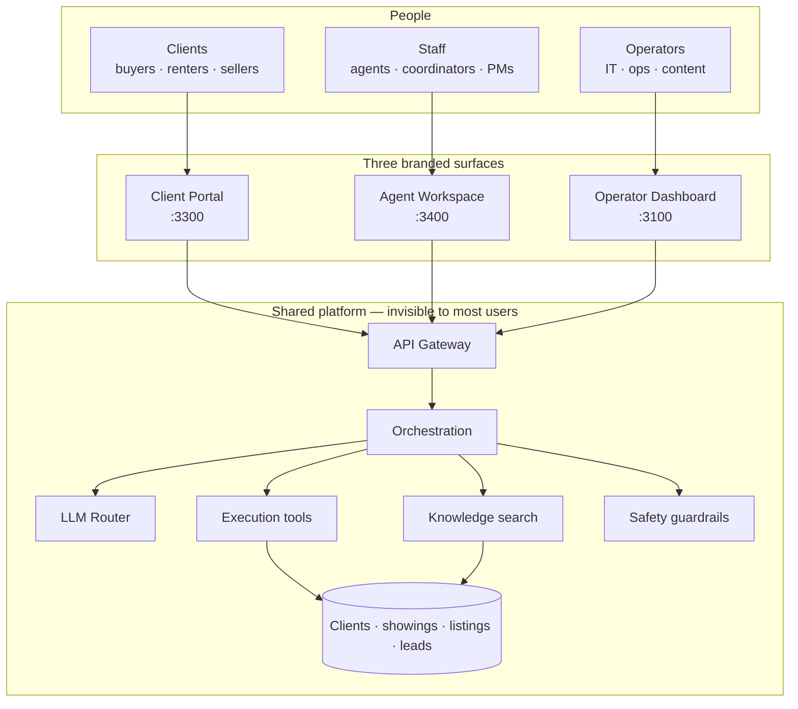

---

## Non-technical user flows — Client Portal

**Primary question the portal answers:** *“What do I need today?”*

### Use case map

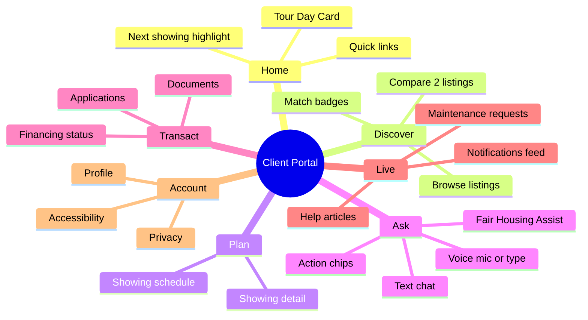

### Flow 1 — Morning of a showing (Tour Day Card)

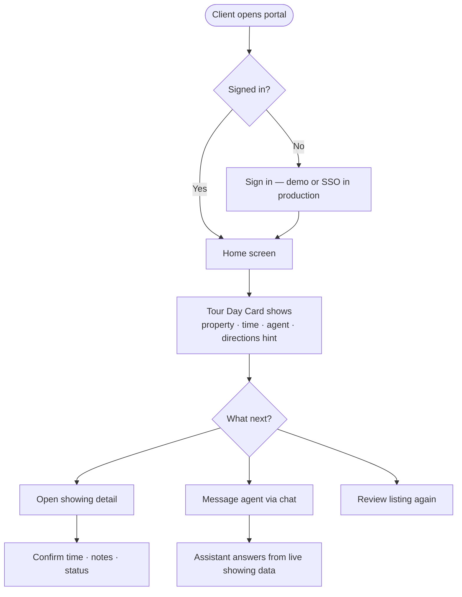

**Value:** Client sees the **same showing record** the agent sees—no “let me check and call you back.”

### Flow 2 — Find and compare listings

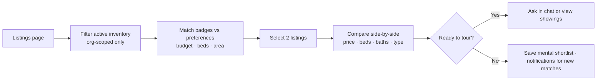

**Value:** Search stays **inside the brokerage brand** with preference-aware ranking—not a generic internet search.

### Flow 3 — Chat with guardrails and quick actions

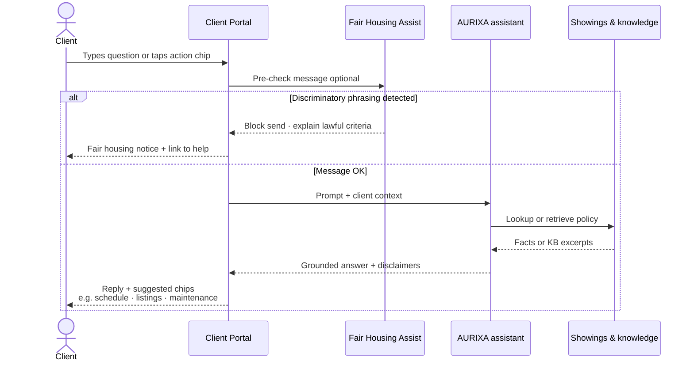

**Example prompts:** “When is my next showing?” · “What should I bring to a tour?” · “Submit a maintenance request for my unit.”

### Flow 4 — Voice (same brain as chat)

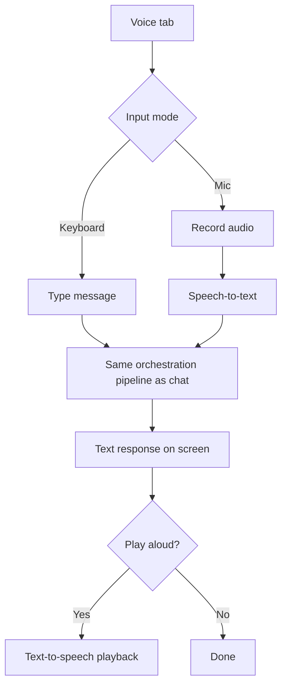

### Flow 5 — Maintenance, applications, financing

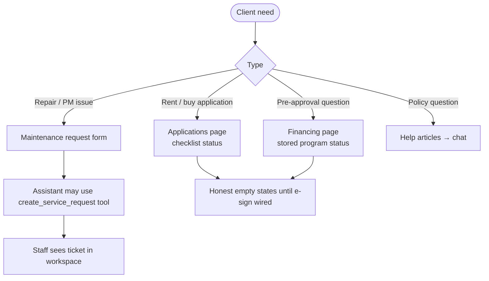

---

## Non-technical user flows — Agent Workspace

**Primary question the workspace answers:** *“Who needs me today, and what do I need to know about them?”*

### Use case map

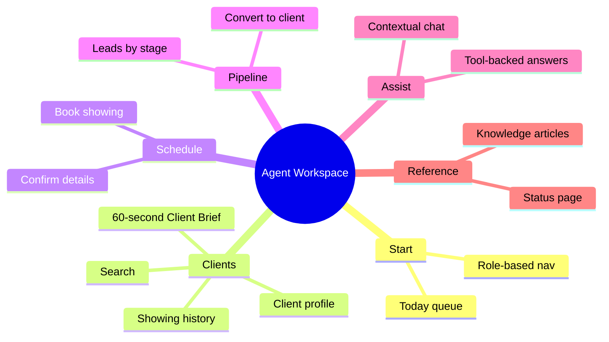

### Flow 1 — Start of day

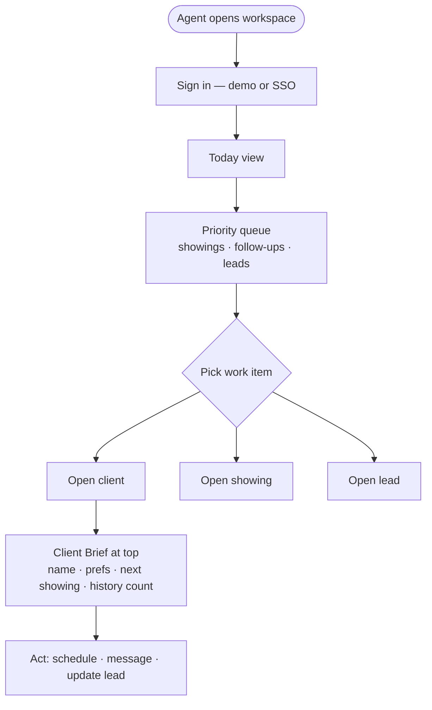

**Value:** **60-second Client Brief** surfaces what used to require CRM + email + calendar hunting.

### Flow 2 — Client conversation support

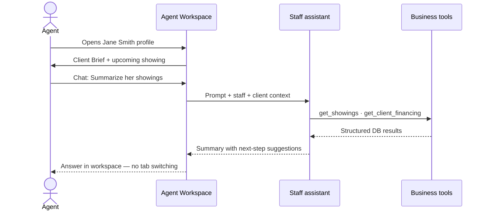

### Flow 3 — Schedule a showing

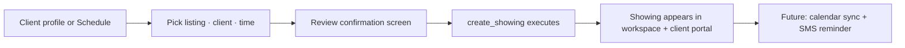

### Flow 4 — Lead pipeline

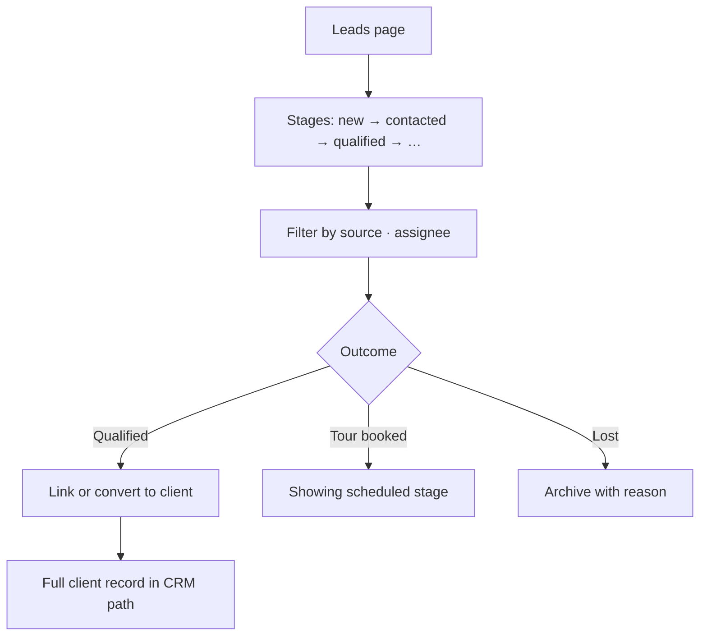

**Segments supported in data model:** residential buy/sell · property management · developer sales (each with default pipeline stages).

---

## Non-technical user flows — Operator Dashboard

**Primary question the dashboard answers:** *“Is the platform healthy, trustworthy, and ready for our brokerages?”*

### Use case map

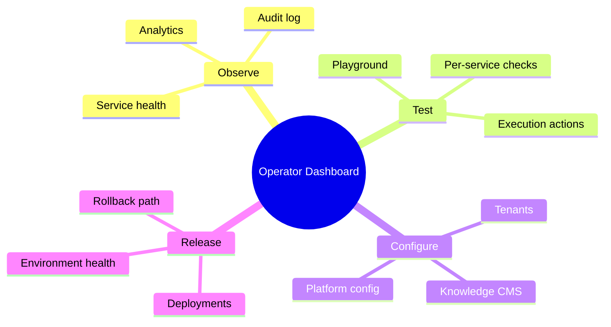

### Flow 1 — Trust before demo or release

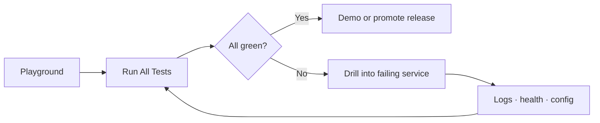

### Flow 2 — Operate multi-tenant brokerages

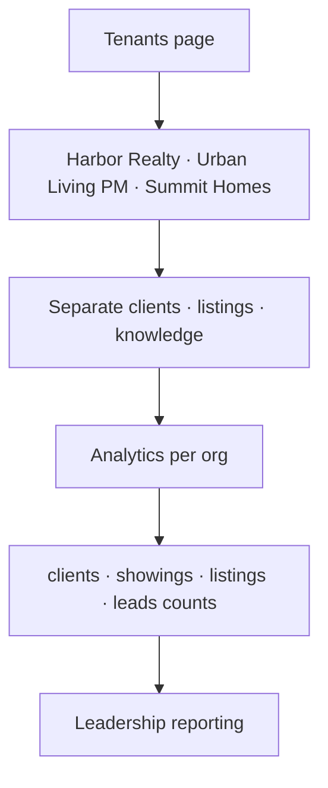

### Flow 3 — Content and compliance oversight

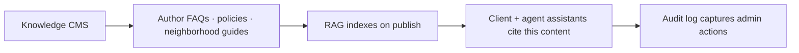

### Operator control loop

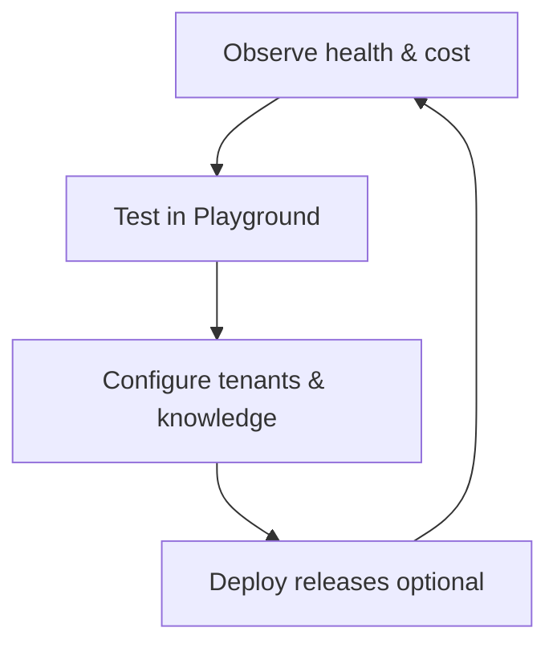

---

## AI capabilities — live today

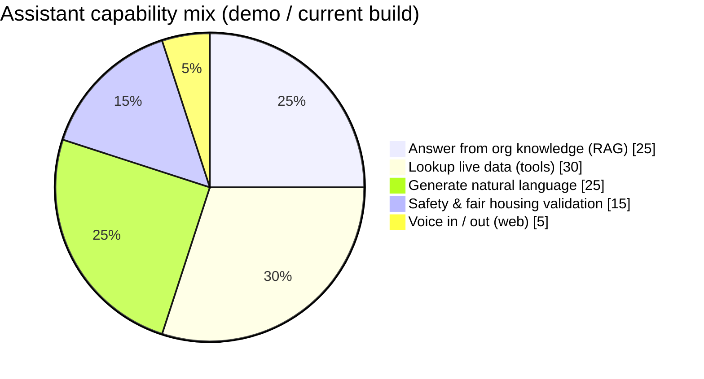

### Conversational intelligence

| Capability | Status | Description |
| --- | --- | --- |
| **Intent routing** | Live | Classifies showing, listing, financing, maintenance, policy, and related intents |
| **Semantic routing** | Live | Embedding-based intent hints in LLM router |
| **Multi-provider LLM** | Live | OpenAI, Anthropic (e.g. Claude Haiku), Google Gemini, local OpenAI-compatible (LM Studio) |
| **Cost-aware routing** | Live | Keyword rules prefer faster/cheaper models where configured |
| **Client channel persona** | Live | Real estate guide; no legal/tax advice; fair-housing neutral tone |
| **Agent channel persona** | Live | Operational assistant; suggests next actions (schedule, lead stage, tickets) |
| **Hybrid RAG** | Live | BM25 + vector retrieval over tenant knowledge articles |
| **Agent runtime tools** | Live | Keyword-triggered calls to execution engine |
| **Streaming responses** | Partial | Pipeline returns full text; token streaming UI is future |

### Registered execution tools (AI can invoke)

| Tool | Real estate use |
| --- | --- |
| `get_showings` | “When is my next tour?” |
| `create_showing` | Schedule a private tour or open house |
| `get_listings` / `get_listing_detail` | Inventory questions |
| `get_availability` | Agent or listing time windows |
| `get_client_financing` | Pre-approval / lender status |
| `create_service_request` | Maintenance or PM tickets |
| `create_lead` / `update_lead_stage` | Pipeline updates |
| `get_deal_status` | Transaction stage lookup |
| `search_knowledge_base` | Policy and FAQ answers |

### Safety & compliance AI

| Policy | Trigger examples | Action |
| --- | --- | --- |
| **Fair housing** | Steering, protected-class filters | Block/sanitize; client-side Fair Housing Assist in chat |
| **Legal escalation** | “Is this contract binding?” | Disclaimer; escalate to licensed professional |
| **Fraud escalation** | Wire urgency, gift-card payment | Immediate staff flag |
| **Property emergency** | Gas leak, fire | 911 guidance + escalation notice |
| **PII redaction** | SSN, account numbers in logs | Redact in pipeline output |

### Client experience AI features (recent)

| Feature | Portal | What it does |
| --- | --- | --- |
| **Tour Day Card** | Client home | Surfaces next showing with property context |
| **Listing match badges** | Listings | Scores listings vs client preferences |
| **Compare listings** | Listings | Side-by-side two properties |
| **Chat action chips** | Chat | One-tap “next showing”, “browse listings”, etc. |
| **Fair Housing Assist** | Chat | Pre-send policy check on risky phrasing |
| **Live notifications feed** | Notifications | Showing reminders + new listing match hints |
| **Client Brief** | Agent client page | 60-second agent summary |

### Voice AI stack (web)

| Layer | Implemented providers |
| --- | --- |
| **STT** | Vosk, faster-whisper (OSS); optional AssemblyAI, Deepgram, OpenAI Whisper |
| **TTS** | Piper, edge-tts (OSS); optional OpenAI, ElevenLabs |
| **Pipeline** | Same orchestration as chat after transcription |

---

## AI capabilities — planned or extensible

| Capability | Target value |
| --- | --- |
| **Proactive nudges** | “Your showing is in 2 hours” push/SMS |
| **Lead scoring** | ML rank on engagement + preferences |
| **MLS-aware answers** | Synced listing freshness and status |
| **Document Q&A** | Lease and disclosure understanding (with legal disclaimers) |
| **Multi-language** | Spanish, Hindi, etc. for diverse markets |
| **Agent copilot drafts** | Email/SMS draft from client context |
| **Comparative market analysis assist** | Summarize comps from approved data only |
| **Telephony IVR** | Phone tree → same assistant brain |

---

## Integrations — built vs not yet plugged in

### Architecture already in the repo

| Layer | Built | Plugged in for demo? |
| --- | --- | --- |
| **LLM clients** (OpenAI, Anthropic, Gemini, LM Studio) | Yes | Yes — via env keys |
| **RAG + knowledge CMS** | Yes | Yes — seeded articles |
| **Execution engine tools** | Yes | Yes — Postgres |
| **Safety guardrails service** | Yes | Yes |
| **Streaming voice service** | Yes | Yes — web only |
| **Deployment controller + EKS path** | Yes | Optional — ops teams only |
| **Client / workspace OIDC routes** | Yes | No — demo auth locally |
| **Webhook ingress stubs** (DocuSign, CRM) | Spec only | No |
| **Integration connector interface** | Spec in docs | No runtime hub yet |

### External systems — specified, not live in demo

From [`REAL_ESTATE_INTEGRATIONS.md`](./REAL_ESTATE_INTEGRATIONS.md):

| Priority | System | Direction | Demo status |
| --- | --- | --- | --- |
| P0 | **Google / Microsoft 365 Calendar** | Bi-directional showings | Not wired |
| P0 | **CSV / manual listing import** | Inbound | Manual seed only |
| P1 | **Follow Up Boss, HubSpot** | Leads & contacts | Not wired |
| P1 | **RESO Web API (MLS)** | Inbound listings | Not wired |
| P2 | **Salesforce** | CRM sync | Not wired |
| P2 | **AppFolio, Buildium** | PM units & work orders | Not wired |
| P3 | **DocuSign** | E-sign envelopes | Not wired |
| P3 | **Mapbox / Google Maps** | Geocoding & maps | Not wired |

### Channels — built vs planned

| Channel | Status |
| --- | --- |
| Web chat (Client Portal) | **Live** |
| Web voice REST + WebSocket | **Live** |
| PSTN phone (Twilio, etc.) | Planned |
| SMS reminders | Stub / planned |
| WhatsApp | Planned |
| Native mobile SDK | Planned |

### Auth & enterprise

| Item | Status |
| --- | --- |
| Client Portal OIDC (`CLIENT_OIDC_*`) | Routes exist; configure for production |
| Agent Workspace OIDC (`WORKSPACE_OIDC_*`) | Routes exist; configure for production |
| Dashboard GitHub OAuth | Production path documented |
| Fine-grained RBAC | Intent documented; full enforcement roadmap |

---

## Value delivered

### By stakeholder

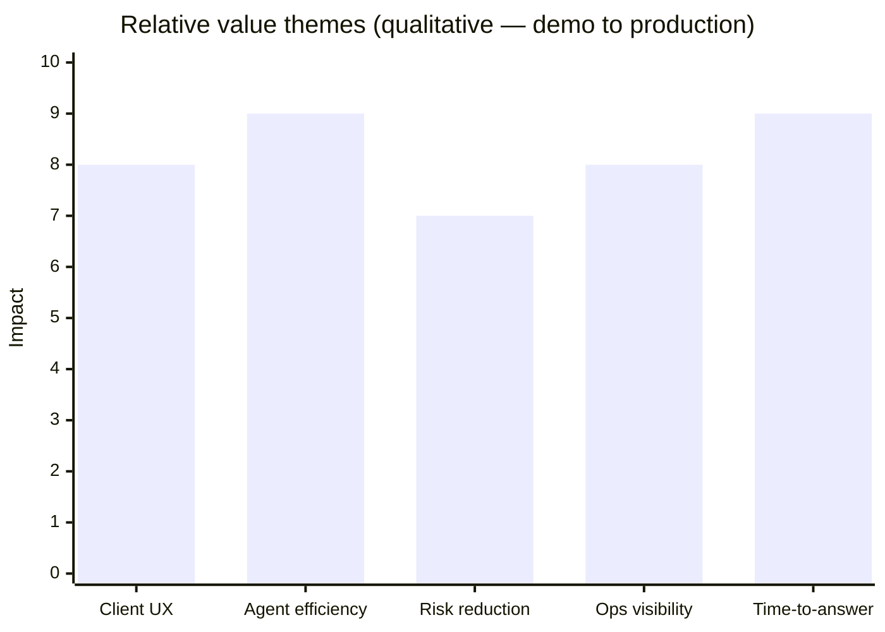

| Stakeholder | Value delivered |
| --- | --- |
| **Clients** | 24/7 answers; tour visibility; branded listing discovery; clear limits on legal/fair housing advice |
| **Agents** | Single client view; fewer repeat lookups; contextual AI; scheduling without leaving workspace |
| **Brokers / PM owners** | Brand-owned digital front door; audit trail; multi-office tenant model |
| **Compliance / legal** | Fair housing and fraud guardrails; disclaimers; escalation paths—not a replacement for training |
| **IT / platform** | Health checks, playground, deployment pipeline, observability hooks |

### Measurable outcomes (target KPIs)

| KPI | How AURIXA helps |
| --- | --- |
| **Inbound call volume** | Deflect “when is my showing?” and FAQ calls to portal + assistant |
| **Time-to-first-answer** | Seconds via chat vs hours waiting for callback |
| **Agent handle time** | Client Brief + tool-backed summaries reduce context gathering |
| **Policy consistency** | RAG over approved articles vs ad-hoc agent memory |
| **Incident traceability** | Audit logs + pipeline step records |
| **AI spend control** | Router selects model tier (e.g. Haiku for routine turns) |

### Cost of ownership (demo vs production)

| Mode | Typical use | Notes |
| --- | --- | --- |
| **Local / EC2 demo** | Sales, UX validation | Postgres + Redis in compose; Claude Haiku API pennies per demo |
| **AWS EKS staging** | Pilot brokerages | Full Helm path; higher infra floor |
| **Production multi-tenant** | GA brokerages | SSO, MLS/CRM adapters, RBAC hardening |

---

## Business model positioning (SaaS)

AURIXA fits the **vertical ops platform** category—not a horizontal chatbot API:

- **Per-organization tenancy** with isolated clients, listings, and knowledge
- **Usage-sensitive AI costs** passed through or bundled via model routing
- **Expansion revenue** via integrations (MLS, CRM, calendar, e-sign), additional seats, and voice/telephony channels

---

## What to tell different audiences

| Audience | Message |
| --- | --- |
| **Brokerage owner** | “Your clients get a branded app that knows their showings; your agents stop retyping the same answers.” |
| **Agent team lead** | “One workspace for today’s queue, client briefs, and an assistant that reads our data—not the internet.” |
| **Compliance** | “Guardrails and audit—not autopilot. We escalate fair housing and fraud language.” |
| **IT** | “Microservices behind one gateway; playground proves health; production path is Terraform + EKS + Helm.” |
| **Investor** | “Vertical SaaS for a $100B+ industry still running on fragmented CRM + phone + PDF.” |

---

## Demo entry points

| Portal | URL (local) | Demo identity |
| --- | --- | --- |
| Client Portal | `http://localhost:3300` | Jane Smith (buyer), local demo sign-in |
| Agent Workspace | `http://localhost:3400` | Demo Agent @ Harbor Realty |
| Operator Dashboard | `http://localhost:3100` | Playground, Analytics, Tenants |

**Sample showing:** 123 Oak Street, ~tomorrow, agent Alex Rivera — visible in both client and agent surfaces.

---

## Related documentation

| Document | Purpose |
| --- | --- |
| [DEMO_PRESENTATION.md](./DEMO_PRESENTATION.md) | 15-minute live demo script |
| [REAL_ESTATE_DOMAIN.md](./REAL_ESTATE_DOMAIN.md) | Entity model, roles, pipelines |
| [REAL_ESTATE_INTEGRATIONS.md](./REAL_ESTATE_INTEGRATIONS.md) | Connector contracts and phases |
| [STREAMING_AND_END_USER_FLOWS.md](./STREAMING_AND_END_USER_FLOWS.md) | Chat and voice mechanics |
| [FRONTEND_AUTH.md](./FRONTEND_AUTH.md) | Production SSO wiring |
| [DEPLOYMENT_RUNBOOK.md](./DEPLOYMENT_RUNBOOK.md) | AWS / EKS production path |

---

## Positioning disclaimer

AURIXA provides **decision support and workflow automation** for real estate organizations. It does not replace licensed agents, attorneys, inspectors, or fair-housing training. Listing data in demo environments is seeded; production accuracy depends on MLS, CRM, and operator-maintained sources. AI responses should be reviewed for high-stakes decisions.
