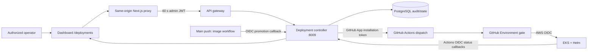

# Deployment infrastructure

This document describes the implemented deployment control plane. For
provisioning, incidents, rollback, and disaster recovery, use the
[deployment runbook](../docs/DEPLOYMENT_RUNBOOK.md).

> [!IMPORTANT]
> Nothing in this repository runs `terraform apply` or creates AWS resources
> automatically. AWS remains untouched until an operator supplies credentials,
> replaces the example inputs, reviews a plan, and explicitly applies it.
> Deployment writes are also disabled unless `DEPLOYMENT_WRITES_ENABLED=true`.

## Control-plane architecture



The dashboard uses GitHub OAuth with `read:org`. Sign-in requires active
membership in an allowlisted organization and, when configured, an allowlisted
team. Browser requests stay same-origin: the dashboard server creates a
short-lived JWT and proxies through the API gateway to the controller. The
gateway and controller independently enforce issuer, audience, role, and the
write-enable switch.

The controller records releases, jobs, steps, approvals, service revisions, and
audit events. It uses a GitHub App installation token to dispatch `deploy.yml`
and cancel workflow runs. Actions sends status and promotion callbacks with
short-lived GitHub OIDC tokens restricted to exact repositories and audience;
no static callback credential is required.

## Local deployment utility

`infra/deployment/services.json` is the canonical inventory of **13 deployable
applications**: ten backends (including `deployment-controller` on `8009`) and
three frontends. `db-migrations` is a release artifact, not a service.

```bash
pnpm run deploy validate
pnpm run deploy build [service ...]
pnpm run deploy up [service ...]
pnpm run deploy verify [service ...]
pnpm run deploy status
pnpm run deploy down
```

Validation checks the inventory, Dockerfiles, unique names and ports, the
required controller, and Compose configuration. Cloud deployment, promotion,
and rollback are CI-owned; the utility deliberately rejects those commands.

For a local dashboard demonstration, set a high-entropy `AUTH_SECRET` and
`DEPLOYMENT_JWT_SECRET`, set `DEPLOYMENT_DEV_AUTH_ENABLED=true`, keep
`NODE_ENV` non-production, and start the stack. Use **Local development** on the
sign-in page, then open `http://localhost:3100/deployments`. Writes remain
disabled unless explicitly enabled.

## Release flow

1. A push to `main` runs **Image Build & Publish** for all 13 applications plus
   `db-migrations`.
2. Images are published to immutable ECR repositories as
   `sha-<40-character-git-sha>`, scanned with Trivy, and emitted in an
   `image-manifest` artifact with digests. BuildKit publishes provenance and
   SBOM attestations. Optional GHCR mirroring copies the digest; Docker Hub is
   not used.
3. After a successful main build, Actions authenticates to the controller with
   OIDC and automatically requests a rolling, all-service **staging**
   deployment using that manifest run ID. Production cannot be auto-promoted.
4. The controller dispatches `deploy.yml` through the GitHub App. Manual
   dashboard requests use the same path.
5. The workflow assumes the environment's AWS deployment role through OIDC,
   resolves every selected service and migration image to its manifest digest,
   and runs `helm upgrade --install --atomic --wait`.
6. Staging and production run the digest-pinned Alembic migration as a Helm
   `pre-install,pre-upgrade` hook, wait for Kubernetes rollouts, run `helm test`,
   and call the configured smoke URL.
7. Actions reports each phase and deployed image reference to the controller
   with OIDC. On failure it uploads 14-day diagnostics and rolls back to the
   prior deployed Helm revision when one exists.

Production requests should target a GitHub Environment named `production` with
required reviewers. The dashboard also requires the literal confirmation
`DEPLOY PRODUCTION`; controller-managed environments can require an approval
before dispatch. The GitHub Environment remains the authoritative CI gate for
AWS access and deployment variables.

## Terraform and Helm

Terraform state bootstrap is intentionally separate:

1. In `infra/terraform/bootstrap`, run `terraform init`, review a plan, and
   explicitly apply with a globally unique `state_bucket_name`.
2. Create a backend file outside version control from
   `infra/terraform/backend.hcl.example`.
3. In `infra/terraform`, initialize with
   `terraform init -backend-config=/secure/path/backend.hcl`.
4. Replace documentation CIDRs and placeholders, then plan with
   `-var-file=environments/<environment>.tfvars`. Pass only Secrets Manager
   ARNs through `secrets_manager_arns`, never secret values.
5. Apply only after account, security, DNS/TLS, and cost review.

Modules provision a VPC, private EKS nodes and add-ons, immutable scan-on-push
ECR repositories, encrypted RDS and ElastiCache, OIDC/IRSA, and a
least-privilege External Secrets role. Production enables RDS deletion
protection; non-production uses one NAT gateway while production uses the
network module's multi-AZ layout.

The umbrella chart is `infra/helm/aurixa`. Environment overlays contain no
credentials. Before enabling their consumers, install an ingress controller,
metrics support, External Secrets Operator and `ClusterSecretStore`, DNS, and
TLS. Set four public hosts (API, dashboard, client portal, and agent workspace) and build
frontend images with `NEXT_PUBLIC_API_GATEWAY_URL` matching
`global.frontend.apiGatewayUrl`.

Workloads use non-root users, read-only root filesystems, writable temporary
mounts, probes, network policies, autoscaling, and production disruption
budgets. Prefer `services.<name>.image.digest`; release commit, controller job
ID, service scope, and strategy are attached as traceability metadata.

## Required configuration

### GitHub repository or environment variables

| Variable                              | Scope                    | Purpose                                      |
| ------------------------------------- | ------------------------ | -------------------------------------------- |
| `AWS_REGION`                          | Repository or both envs  | ECR and EKS region                           |
| `AWS_IMAGE_PUBLISH_ROLE_ARN`          | Repository               | OIDC role for ECR publication                |
| `AWS_DEPLOY_ROLE_ARN`                 | Staging and production   | OIDC role for EKS/Helm                       |
| `ECR_REPOSITORY_PREFIX`               | Repository and both envs | Terraform-created repository prefix          |
| `EKS_CLUSTER_NAME`                    | Staging and production   | Target cluster                               |
| `HELM_CHART_PATH`                     | Staging and production   | Normally `infra/helm/aurixa`                 |
| `HELM_RELEASE`                        | Staging and production   | Helm release name                            |
| `KUBE_NAMESPACE`                      | Staging and production   | Kubernetes namespace                         |
| `SMOKE_URL`                           | Staging and production   | Public health endpoint                       |
| `DEPLOYMENT_CONTROLLER_URL`           | Repository and both envs | Externally reachable controller callback URL |
| `DEPLOYMENT_CONTROLLER_OIDC_AUDIENCE` | Repository and both envs | Must match controller OIDC audience          |
| `MIRROR_GHCR`                         | Repository, optional     | Set `true` to mirror ECR images to GHCR      |

Use the built-in `GITHUB_TOKEN` for artifact download and optional GHCR writes;
no Docker Hub credentials are used. Configure the `production` GitHub
Environment with required reviewers and restrict its deployment branches.

### Runtime secrets and settings

- Dashboard OAuth: `AUTH_SECRET`, `AUTH_GITHUB_ID`,
  `AUTH_GITHUB_SECRET`, `AUTH_GITHUB_ALLOWED_ORGS`, and optional
  `AUTH_GITHUB_ALLOWED_TEAMS`.
- Same-origin proxy: `DEPLOYMENT_GATEWAY_URL`, `DEPLOYMENT_JWT_SECRET`
  (at least 32 characters), `DEPLOYMENT_JWT_ISSUER`, and
  `DEPLOYMENT_JWT_AUDIENCE`.
- Controller dispatch: `GITHUB_APP_ID`, `GITHUB_APP_INSTALLATION_ID`,
  `GITHUB_APP_PRIVATE_KEY`, and `GITHUB_WORKFLOW_FILE`.
- Actions callbacks: `GITHUB_OIDC_AUDIENCE`,
  `GITHUB_OIDC_REPOSITORIES`, and
  `GITHUB_OIDC_PROMOTION_ENVIRONMENTS=staging`.
- Runtime policy: `DEPLOYMENT_ALLOWED_SERVICES`,
  `DEPLOYMENT_ADMIN_ROLES`, and the deny-by-default
  `DEPLOYMENT_WRITES_ENABLED`.
- Application runtime: `DATABASE_URL`, `REDIS_URL`, provider credentials, and
  other application secrets stored in AWS Secrets Manager and synchronized by
  External Secrets.

The GitHub App needs repository metadata read, Actions read/write (dispatch and
cancel), and access to the target repository. The OAuth App callback is
`<dashboard-origin>/api/auth/callback/github`.

## Cost drivers

The principal recurring costs are EKS worker nodes, NAT gateways and data
processing, RDS, ElastiCache, load balancers, ECR storage/scanning, CloudWatch
logs/metrics, inter-AZ or internet transfer, Secrets Manager, DNS/TLS, and
GitHub Actions minutes/artifact retention. Application model, speech, and
external API usage is additional. Right-size node counts, database/cache
classes, retention, replicas, and autoscaling bounds per environment.
